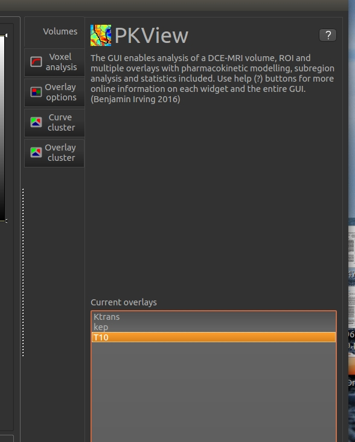

# Feature Summary

A list of PKView features and their current status. Detailed explanations can be found 
in the [Pkview documents](http://pkview.readthedocs.io/en/latest/).

## Visualisation

 - Axial, coronal and sagittal views
 - ROI overlay
 - Overlay maps for the entire image or constrained to the ROI
 - Switching between multiple overlays
 - Dynamic signal enhancment visualisation
 - individual voxel curve analysis
 - Multivoxel curve analysis
 
## IO

- Load DCE-MRI, ROI and overlays
- Save overlays as 3D images

## Modelling
- PK modelling of clinical and preclinical DCE-MRI 
(*this implementation still requires testing*)
- Command line batch T10 and PK modelling 
(*T1 modelling should be implemented as a widget as well*)
- Visualisation of model fit

## Analysis
=======
## Analysis
- Region map statistics
- PCA based curve clustering
- Overlay clustering

# Wishlist
Wishlist of things to implement

### 1) Multiple ROIs

- Switch between mutiple ROIs in the same way that you can switch between multiple
overlays (see fig)
  - (enhancement) Make certain outputs such as clustering an ROI instead of an overlay
so that it can be used for regional analysis



### 2) Supervoxel extraction
- Add a widget for the Perfusion supervoxel method
- Open source available at: https://github.com/benjaminirving/perfusion-slic
- This is a preprocessing step but useful to implement as a demo of the method
- Challenge is visualising the superovoxels by their edges
- Rather label define the whole region as an ROI of integers

### 3) Histogram analysis of ROI
- Add a regional histogram options in the overlay options widget
- Provide options to set number of bins and range so that comparisons can be made between cases
- This would be really useful for Tessa and Helen's work on the Rhythm and Perform trials.
- Under the current overlay statistics


### T1 widget
- Create a T1 widget that generates a T1 map from a series of variable flip angle images
- The code is implemented in PKView for command line use and must just be integrated as a widget
- The current command line version passes a yaml configuration file as an argument
- There are two versions:
*1) T1 with actual flip angle caclulation (preclinical)*
```
PKView --T10afibatch eg3_t10config_preclinical.yaml
```

*2) T1 without actual flip angle (clinical)*
```
PKView --T10afibatch eg2_t10config_clinical.yaml
```
- These yaml arguments can be integrated into a widget
- Code:
		- Python wrapper code is found in `pkview/analysis`
		- c++ analysis code is found in `src/` 

### Test PK modelling and T10 modelling   
- The PK and T10 modelling in the widget require further testing (Ben TODO)
- Steps
		- Include example publicly available test dataset
		- Include automated c++ (googletest) tests for the code to validation

### Migration of PySide2 when released.
- The current implementation uses PySide which is based on Qt4
- Update to PySide2 when released which uses Qt5
- Will provide support for HiDPI screens and proper scaling in OSx

# Publications

Publications linked to this work:
To add
