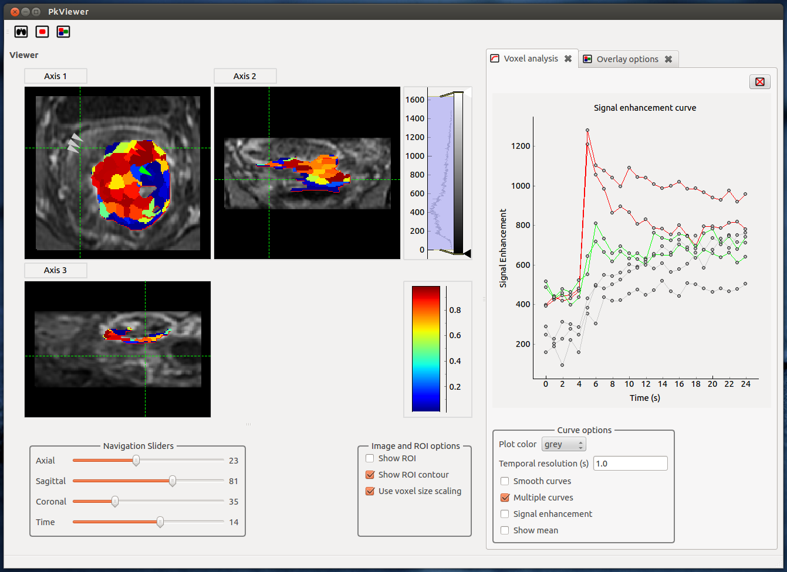

PkView
======
Viewer for 3D/4D data and Pk modelling
Benjamin Irving



### Dependencies:
Python 2.7

#### Python libraries:

- PySide
- matplotlib
- numpy 
- nibabel
- pyqtgraph
- Cython
- scikit-image
- scikit-learn


### Overview


### Installation

This GUI now uses c++ and cython code for the pharmacokinetic modelling. Therefore, compilation of some of the libraries
is required before running. 

run the following steps:
```bash
cd analysis/pkmodel_cpp
python setup.py build_ext --inplace
```

### Usage

``` bash
python PkView2.py
```
or

``` bash
./PkView2.py
```

See:
https://github.com/benjaminirving/PkView_help_files
for usage


