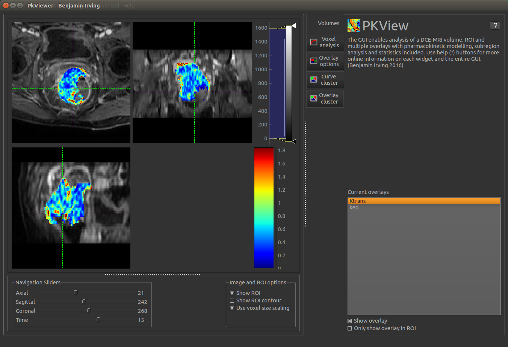
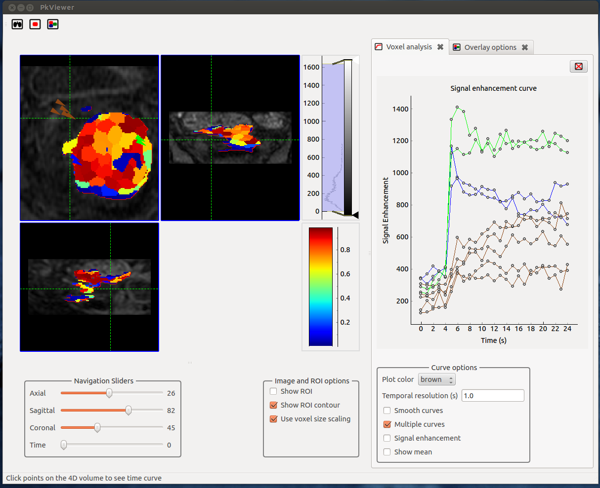

# PkView

Viewer for 3D/4D data and Pk modelling

Contributors:

Benjamin Irving

Clinical advice: 

Jamie Franklin

## Overview
This viewer provides tools for modelling and analysis of DCE-MRI scans. 

Key features:
- 4D DCE-MRI images can be loaded and viewed from nifti images
- Signal enhancement curves can be visualised and analysed
- Pharmacokinetic modelling
- Visualisation of model fitting quality
- Visualisation of parameter maps
- Clustering of a region based on the perfusion curves
- Clustering of a region based on a parameter map
- Quantification of parameters within subregions of the tumour
- Python console to interact with the loaded data and analysis (advanced users)

See:
[http://pkview.readthedocs.org/en/latest/](http://pkview.readthedocs.org/en/latest/) for usage.

## Installation
The easiest method of installation is to run the exe or deb files for Windows and Ubuntu (OSx coming soon). 

See Release 0.20 under tags.  Consider this alpha software. Contributions and improvements to the code and 
documentation are welcome. 

For windows, unzip the file and run the pkviewer executable. There are a large number of files so it's easiest to add
the program to the launcher once run once. 

Alternatively, the GUI can be run from the source. See guides below for setting up Ubuntu or OSx. 






## Key files

**pkviewer2.py**: Run the GUI and perform analysis

**cmd_pkmodel.py**: Run pkmodelling from the command line (config file *cmd_pkconfig.yaml*)

**cmd_t10.py**: Run T10 mapping from the command line (config file *cmd_t10config.yaml*)

## Running from source
Tested on Ubuntu 14.04 and OSx 10.11. Although it runs on Windows, Ubuntu and OSx.

Dependencies:
Python 2.7 or python 3.4

Python libraries:
- PySide
- matplotlib
- numpy 
- nibabel
- pyqtgraph
- Cython
- scikit-image
- scikit-learn
- scipy


## OSx 10.11
*NB: this guide is still a work in progress. Please let me know if something doesn't work*

For OSx it is recommended that you don't use the system version of python so that libraries can be updated without
affecting the underlying system. 

1) Homebrew is ideal for running a separate version of python. Install homebrew from http://brew.sh/ if it's not 
already installed. 

2) Install python
```bash
brew update
brew install python
```

2) git clone this repository

3) cd into the directory

```bash
# Install dependencies
pip install -U pip
pip install -U setuptools
pip install numpy 
pip install scipy
pip install -r requirements.txt
pip install PySide
```

4) Run the script
```bash
python pkviewer2.py
```

## Ubuntu 14.04 
*NB: this guide is still a work in progress. Please let me know if something doesn't work*

### Option 1: Using a system python. Libraries may be out of date and option 2 is recommended. 

1) Install dependencies
```bash
sudo apt-get install build-essentials pip python-all-dev numpy scipy python-pyside
```

2) Install required python libraries using pip

3) Build c++/Cython code
```bash
python setup.py build_ext --inplace
```

4)

``` bash
python pkviewer2.py
```
or

``` bash
./pkviewer2.py
```


### Option 2: Using a python virtualenv

Creating a vm (see https://virtualenv.readthedocs.org/en/latest/)

```bash
sudo apt-get install python-virtualenv     # Installing virtualenv library
mkdir python-vm # make a directory to store the virtualenv
cd ~/python-vm
virtualenv pyvm # Create a vm named pyvm
```

Activating the vm
```
source ~/python-vm/pyvm/bin/activate #start the vim
```

Deactivating the vm

```bash
deactivate
```

Make sure dependencies are installed
```bash
sudo apt-get install libffi-dev libssl-dev
sudo apt-get install gfortran libatlas-base-dev libblas-dev liblapack-dev python-all-dev cmake
sudo apt-get install libfreetype6-dev libfreetype6 libpng12-dev libpng12 qt4-qmake shiboken libshiboken-dev libqt4-dev
```

Installing python libraries in the vm (make sure system libraries in 2) are installed)
```bash
pip install requests[security]
pip install --upgrade pip
pip install --upgrade setuptools
pip install numpy
pip install scipy
pip install -r requirements.txt
pip install PySide
```

## Additional notes:

### Resource file

The resource file is compiled by

For python 2
pyside-rcc resource -o resource.py

For python 3
pyside-rcc resource -o resource.py -py3

This is then imported at the beginning of the app so that the program can find the resources. 

