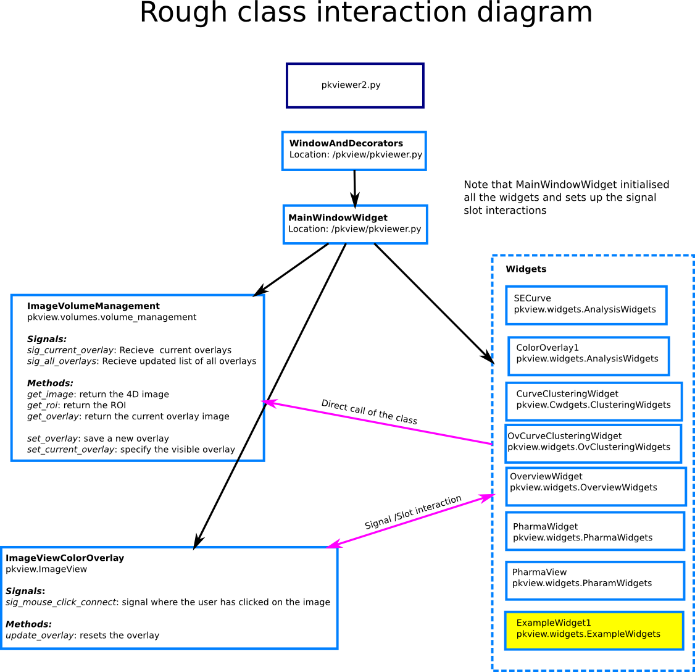

# Quantiphyse

Viewer for 3D/4D data and Pk modelling

Contributors:

Benjamin Irving  
Martin Craig  
Michael Chappell

## Overview
This viewer provides tools for modelling and analysis of MRI scans. 

Key features:
- 4D DCE-MRI images can be loaded and viewed from nifti images
- Signal enhancement curves can be visualised and analysed
- Pharmacokinetic modelling
- Visualisation of model fitting quality
- Visualisation of parameter maps
- Clustering of a region based on the perfusion curves
- Clustering of a region based on a parameter map
- Quantification of parameters within subregions of the tumour
- Python console to interact with the loaded data and analysis (advanced users)

See:
[http://quantiphyse.readthedocs.org/en/latest/](http://quantiphyse.readthedocs.org/en/latest/) for usage.

## Installation

Installation packages are available on the [Wiki](https://ibme-gitcvs.eng.ox.ac.uk/biomedia-perfusion/PkView/wikis/home)

The packages are rather large because they include all dependencies (including Python). However this
does have the advantage of making them standalone.

### Running from source code (for developers)

Running from source is recommended only if your are interested in developing the software further.

1. Install the following dependencies:

Python 2.7 or python 3.4

Python libraries:
- PySide
- matplotlib
- numpy 
- nibabel
- pyqtgraph
- Cython
- scikit-image
- scikit-learn
- scipy

2. Build extensions

`python setup.py build_ext --inplace`

3. Run from source directory

`python quantiphyse.py`

#### OSx 10.11

*NB: this guide is still a work in progress. Please let me know if something doesn't work*

Installing from source on OSX is not fun. The major issue is QT since the required version (4.8) is 
deprecated and hard to install properly. The instructions below are preserved but have not been
recently tested and you will probably need to use your own initiative a bit.

For OSx it is recommended that you don't use the system version of python so that libraries can be updated without
affecting the underlying system. 

1) Homebrew is ideal for running a separate version of python. Install homebrew from http://brew.sh/ if it's not 
already installed. 

2) Install python
```bash
brew update
brew install python
```

2) git clone this repository

3) cd into the directory

```bash
# Install dependencies
pip install -U pip
pip install -U setuptools
pip install numpy 
pip install scipy
pip install -r requirements.txt
pip install PySide
```

4) Run the script
```bash
python quantiphyse.py
```

#### Using a python virtualenv

If you're running from source it can be a good idea to create a Python virtual environment so the
dependencies you install do not affect anything else on your system. See (https://virtualenv.readthedocs.org/en/latest/) for details.

On Windows, Anaconda is recommended and comes with virtual environment support as standard.

## Additional notes:

### Class diagram



### Resource file

The resource file is compiled by

For python 2
pyside-rcc resource -o resource.py

For python 3
pyside-rcc resource -o resource.py -py3

This is then imported at the beginning of the app so that the program can find the resources. 

