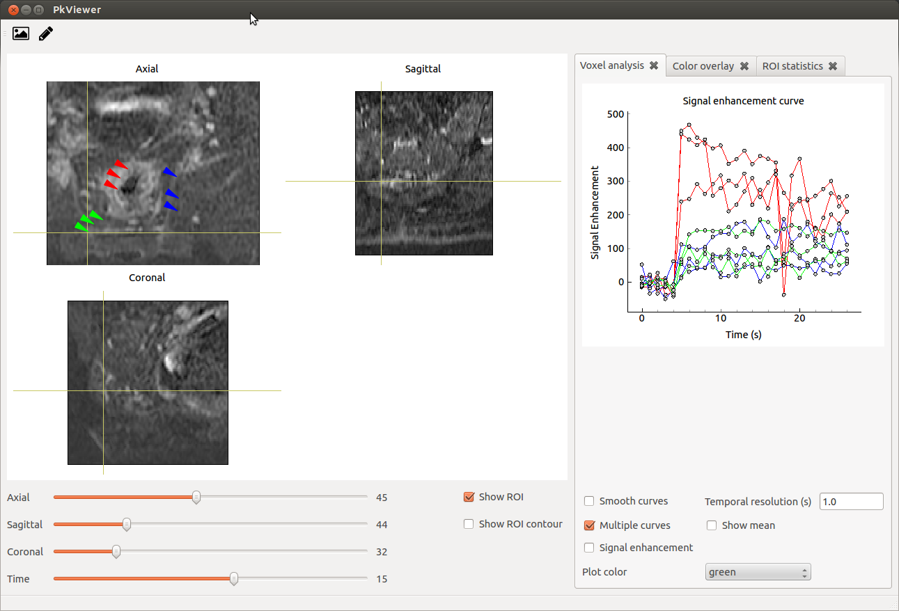
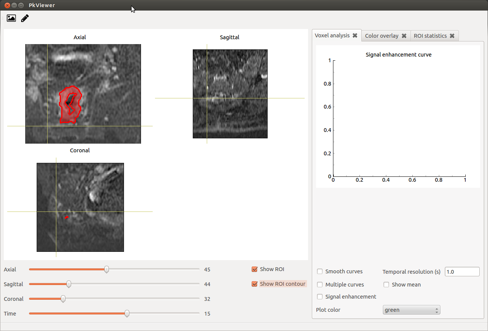
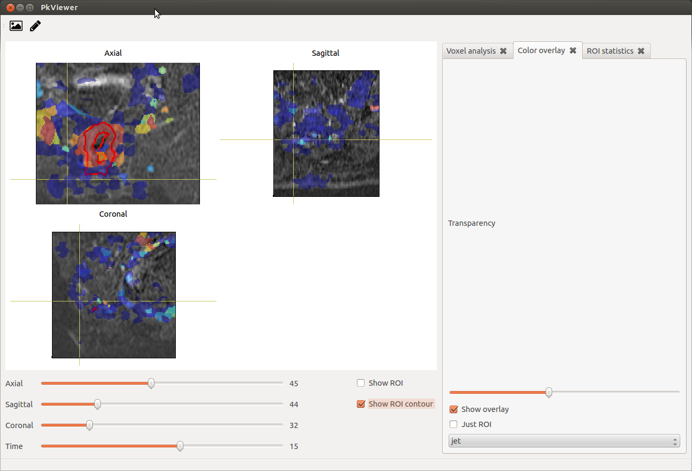

PkView
======

Viewer for 3D/4D data and Pk modelling


### Dependencies:
Python 2.7

#### Python libraries:

- PySide
- matplotlib
- numpy 
- nibabel
- pyqtgraph
- Cython


### Overview

### Code Organisation

PkView.py
- This is the main file. 
- MainWin1 class which inherits from QtGui.QMainWindow and controls the whole window
- MainWidge1(QtGui.QWidget) controls all the sub widgets and loads sidebar widgets into the window. 

libs/ImageView.py
- Controls the main viewing window and interaction with main viewing window
- ImageViewLayout(pg.GraphicsLayoutWidget, object): Provides the basic orthogonal view functionality
- ImageViewOverlay(ImageViewLayout): Adds roi overlay functionality
- ImageViewColorOverlay(ImageViewOverlay): Adds colormap overlay functionality

libs/AnalysisWidgets.py
- Contains sidebar widgets that provide additional functionality

libs/PharmaWidgets.py
- Contains pharmakinetic modelling widgets

analysis/volume_management.py
- Class that manages all the volumes

### Installation

This GUI now uses c++ and cython code for the pharmacokinetic modelling. Therefore, compilation of some of the libraries
is required before running. 

run the following steps:
```bash
cd analysis/pkmodel_cpp
python setup.py build_ext --inplace
```

### Usage

``` bash
python PkView2.py
```
or

``` bash
./PkView2.py
```

Load image :


Enhancement :




Load ROI :




Load overlay :




