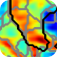
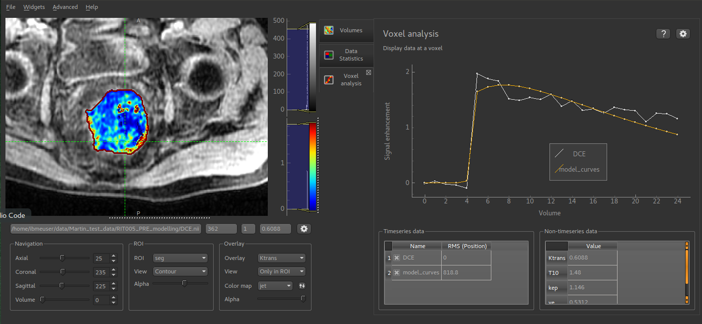
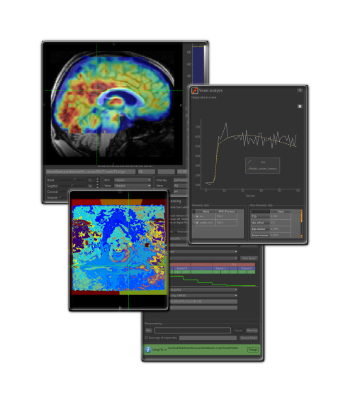

================
|qp| Quantiphyse 
================

Quantiphyse is a viewing and analysis tool for 3D and 4D biomedical data. It is particularly suited 
for physiological or functional imaging data comprised of multi volumes in a 4D (time-) series 
and/or multimodal imaging data. Quantiphyse is built around the concept of making spatially 
resolved measurements of physical or physiological processes from imaging data using either 
model-based or model-free methods, in a large part exploiting Bayesian inference techniques.
Quantiphyse can analyse data both voxelwise or within regions of interest that may be manually or 
automatically created, e.g. supervoxel or clustering methods. 

Features
--------

 - 2D orthographic viewing and navigation of data, regions of interest (ROIs) and overlays
 - Universal analysis tools including clustering, supervoxel generation and curve comparison
 - Tools for CEST, ASL, DCE and DSC-MRI analysis and modelling
 - Integration with selected FSL tools
 - ROI generation
 - Registration and motion correction
 - Extensible via plugins - see :ref:`plugins`.

License
-------
© 2017-2019 University of Oxford

Quantiphyse is **free for non commercial** use. The license details are displayed on first
use and the ``LICENSE`` file is included in the distribution. For further information contact
the `OUI Software Store <https://process.innovation.ox.ac.uk/software>`_. If you are 
interested in commercial licensing you shold contact OUI in the first instance. 

Tutorials
---------

 - `CEST-MRI tutorial <cest_tutorial.html>`_
 - `IMAGO ASL-MRI tutorial <imago_tutorial.html>`_
 - `FSL ASL-MRI tutorial <asl_tutorial.html>`_

Getting Quantiphyse
-------------------

Quantiphyse is available on PyPi - see :ref:`install`.

Major releases of Quantiphyse are also available via the `Oxford University Innovation Software 
Store <https://process.innovation.ox.ac.uk/software>`_. The packages held by OUI have no 
external dependencies and can be installed on Windows, Mac and Linux. They may lag behind
the current PyPi release in terms of functionality.

User Guide
----------

Basic functions
===============

.. toctree::
   :maxdepth: 2

   overview
   getting_started
   overlay_stats
   modelfit
   
Generic analysis and processing tools
=====================================

.. toctree::
   :maxdepth: 1

   compare
   curve_compare
   simple_maths
   reg
   smoothing
   cluster
   sv
   roi_analysis
   roibuilder
   mean_values
   hist
   rp
   
Tools from plugins
==================

.. toctree::
   :maxdepth: 1

   t1
   pk
   cest
   asl_overview

Advanced Tools
==============

.. toctree::
   :maxdepth: 1

   batch
   console
   nifti_extension
   faq
   
Bugs/Issues
-----------

Bugs may be submitted using the Github `issue tracker for Quantiphyse <https://github.com/ibme-qubic/quantiphyse/issues>`_.

For any other comments or feature requests please contact the  `current maintainer: <mailto:martin.craig@eng.ox.ac.uk>`_

Contributors
------------

 - `Martin Craig <mailto:martin.craig@eng.ox.ac.uk>`_ (Current maintainer)
 - `Ben Irving <mailto:mail@birving.com>`_ (Original author)
 - `Michael Chappell <mailto:michael.chappell@eng.ox.ac.uk>`_
 - Paula Croal

Acknowledgements
----------------

 - Julia Schnabel
 - Sir Mike Brady

Images copyright 2018 University of Oxford

