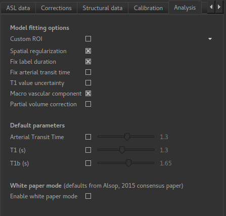
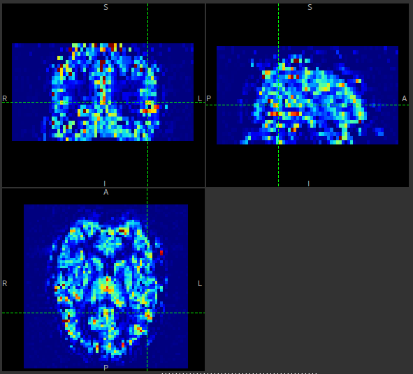
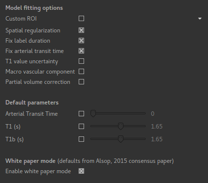

ASL Analysis Tab
================

The analysis tab contains options for the model fitting part of the pipeline.

Model fitting options
---------------------

Custom ROI
^^^^^^^^^^

A custom ROI in which to perform the model fitting can be provided - normally this is generated 
by brain extraction of the structural data (or the ASL data if no structural data is given). 

Spatial regularization
^^^^^^^^^^^^^^^^^^^^^^

This option will smooth the output data using an adaptive method which depends on the degree of 
variation in the data. If there is sufficient information in the data to justify fine grained
spatial detail, it will be preserved, however if the data is not sufficient this will be
smoothed.

The effect is similar to what you would get by applying a smoothing algorithm to the output, 
however in this case the degree of smoothing is determined by the the variation in the data itself.

An example perfusion map without spatial regularization might look like this:

With spatial regularization turned on, the same data set produced the following perfusion map:

.. image:: screenshots/asl_perfusion_svb.png

Fix label duration
^^^^^^^^^^^^^^^^^^

The label duration (bolus duration) can be allowed some variation to better fit the data. If this
option is selected this will not occur. Label duration is fixed by default.

Fix arterial transit time
^^^^^^^^^^^^^^^^^^^^^^^^^

Similarly to the above, this controls whether the arterial transit time (also known as bolus arrival
time) is allowed to vary to fit the data. However, in contrast to the label duration, this is allowed
to vary by default with multi-PLD data.

Arterial transit time cannot be accurately estimated with single-delay data.

T1 value uncertainty
^^^^^^^^^^^^^^^^^^^^

This is analagous to the above options but controls whether the T1 value is allowed to vary. By 
default it is kept constant.

Macro vascular component
^^^^^^^^^^^^^^^^^^^^^^^^

Some of the signal in the ASL data will come from labelled blood in arteries as opposed to
perfused tissue. This may be a significant contribution in voxels containing a major artery. 
By adding a macro vascular component this signal can be estimated and separated from the
tissue perfusion contribution during the fitting process.
  
Partial volume correction
^^^^^^^^^^^^^^^^^^^^^^^^^

If enabled, this will use the GM/WM segmentation to perform an additional modelling step in which
the GM and WM contributes will be modelled separately and based on the GM/WM partial volume within
each voxel (which will also be modelled as part of the fitting process).

.. warn::
    Partial volume correction adds considerably to the pipeline run time!

Override defaults
-----------------

The values given for arterial transit time, T1 and T1b are from the literature, but can
be customized if required.

White paper mode
----------------

'White paper mode' selects defaults and analysis methods to match the recommendations in 
Alsop et al (2014) [1]_. Specifically this selects:

 - Voxelwise calibration
 - Arterial transit time of zero (fixed)
 - T1 and T1b of 1.65s
 - Fixed label duration
 - No macrovascular component

References
----------

.. [1] Alsop, D. C., Detre, J. A., Golay, X. , Günther, M. , Hendrikse, J. , Hernandez‐Garcia, L. , 
      Lu, H. , MacIntosh, B. J., Parkes, L. M., Smits, M. , Osch, M. J., Wang, D. J., Wong, E. C. 
      and Zaharchuk, G. (2015), Recommended implementation of arterial spin‐labeled perfusion MRI 
      for clinical applications: A consensus of the ISMRM perfusion study group and the European 
      consortium for ASL in dementia. Magn. Reson. Med., 73: 102-116. doi:10.1002/mrm.25197
