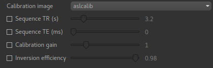
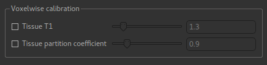
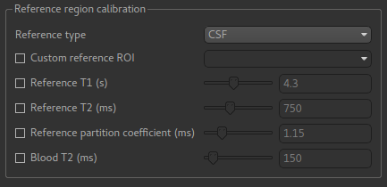
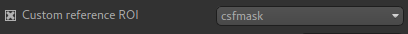

ASL Calibration tab
===================

Without calibration, perfusion values from ASL modelling are relative only and cannot be compared
between subjects or sessions. By providing calibration data the perfusion can be output in 
physical units (ml/100g/min) allowing comparisons to be made.

Two calibration methods are provided: *Voxelwise* and *Reference region*. In both cases you
must provide a calibration image and may override the default acquisition parameters for this
image:

Voxelwise calibration
---------------------

In voxelwise calibration, the calibration image is converted to an M0 image and each voxel in the 
perfusion data is scaled by the voxelwise M0 value in the M0 image.

This requires two parameters, a notional T1 value for generic 'tissue' and a similar generic
partition coefficient. The values given are from standard literature, however they can be
modified if needed.

Reference region calibration
----------------------------

In reference region calibration a *single* M0 correction factor is determined for the whole image, 
by analysing a region of the data containing a single tissue type (typically CSF).

In order to do this, the reference region method requires an ROI which identifies a particular 
tissue type. By default this is calculated automatically for CSF using the following outline method:

 - Obtain the CSF mask from segmentation of the structural image
 - Register the structural image to a standard MNI brain image
 - Obtain (from standard atlases) the ventricle mask for the standard brain image
 - Erode the ventricle mask by 1 voxel and use it to mask the CSF mask from the structural image
 - Transform back into structural space and form the reference region mask by conservatively
   thresholding the ventricle mask at a threshold of 0.9
   
If a tissue type other than CSF is selected, only the first of these steps is performed.

You may prefer to supply a ready made reference ROI. This can be done using the ``Custom reference
ROI`` option:

The T1, T2 and partition coefficient for this tissue type are required for calibration. The default
values vary according to what tissue type you have selected - so the ones displayed above are
appropriate for CSF. These can be modified as required.

