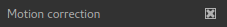
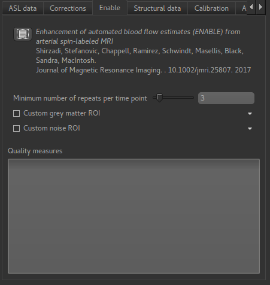
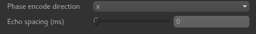
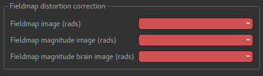
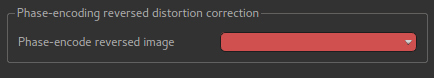

ASL Corrections Tab
===================

Corrections are changes made to the input data before the model fitting is performed. currently
four possible sources of corrections are supported:

Motion correction
~~~~~~~~~~~~~~~~~

If enabled this will apply motion correction to the ASL data set using the FSL ``MCFLIRT``
tool. 

If you prefer, you can do motion correction independently within Quantiphyse (or elsewhere)
and disable this option in the ASL processing.

ENABLE volume selection
~~~~~~~~~~~~~~~~~~~~~~~

This uses the ENABLE method to remove 'bad' volumes from the cASL
data to improve overall quality. This can be useful if there are a small number of volumes
with, for example, major motion artifacts.

When selected, an additional tab appears headed ``ENABLE``:

ENABLE options
^^^^^^^^^^^^^^

``Minimum number of repeats per time point`` 
 
ENABLE will always leave at least this many repeats of each TI/PLD, so for example if you
start out with 8 repeats of each TI/PLD you may end up with 7 repeats of the first TI, 4
of the second, etc. But you will never get just 2 repeats preserved for a TI.

``Custom grey matter ROI``

ENABLE bases its quality measures on signal-noise ratio in grey matter. If you already have
a grey matter ROI for your data you can specify it here. Otherwise ENABLE will use the
segmentation of the structural data you provide on the ``Structural Data`` tab.

``Custom noise ROI``

This is an ROI which defines a part of your data to be used to estimate the noise. 
If you don't specify anything ENABLE will invert the brain mask and use that, which is
normally a reasonable choice.

ENABLE Quality measures
^^^^^^^^^^^^^^^^^^^^^^^

The table of quality measures is filled in after ENABLE has run and provides a summary of
which volumes in your data were kept and which were removed.

Distortion correction
~~~~~~~~~~~~~~~~~~~~~

This corrects for the distortion of the image caused by field inhomogeneities. Two methods are
provided: Fieldmap images or a phase-encode reversed (`Blipped`) calibration image.

Generic distortion correction options
^^^^^^^^^^^^^^^^^^^^^^^^^^^^^^^^^^^^^

Whichever method you select, you will need to select the phase encoding direction and the echo 
spacing. 

The encoding direction is relative to the raw data axes which normally corresponds to scanner
co-ordinates. However you should check the effect of distortion correction visually to ensure
that the changes are in the axis that you expect.

The echo spacing is the true echo spacing (also known as dwell time) and should be specified in
ms. The total readout time is this value multiplied by the number of slices (in the phase encoding
direction) minus 1.

Distortion correction using fieldmap images
^^^^^^^^^^^^^^^^^^^^^^^^^^^^^^^^^^^^^^^^^^^

Three images must be provided - you must load them into Quantiphyse first. The first is the
fieldmap itself, the second is the magnitude image and the third is the brain extracted 
version of the second.

Distortion correction using CBLIP images
^^^^^^^^^^^^^^^^^^^^^^^^^^^^^^^^^^^^^^^^

The CBLIP image must be loaded into Quantiphyse and specified here.
