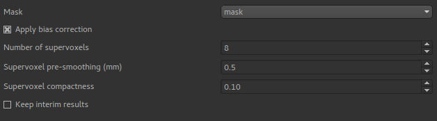
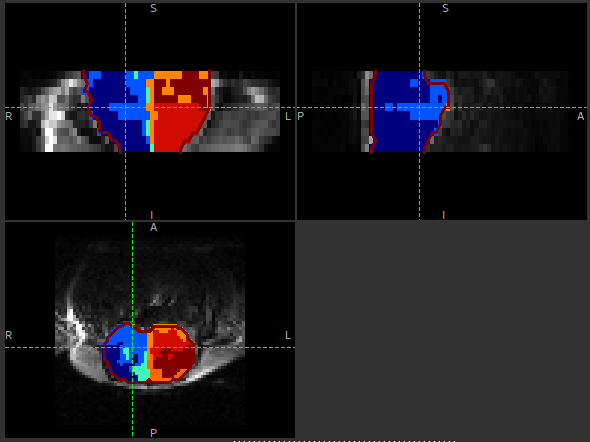
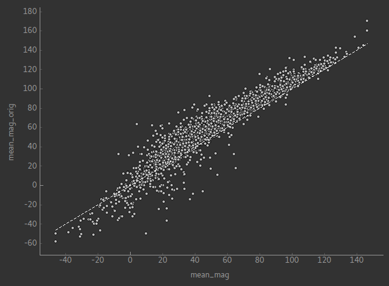

Multiphase ASL
==============

The Multiphase ASL widget is designed for single PLD multiphase ASL data. It performs a model-based 
fitting process which results in a net magnetisation map which can be treated as differenced ASL 
data.

Defining the structure
----------------------

To begin you must define the structure of your ASL data, in the same way as with the other ASL widgets.
Multiphase modelling is currently possible only for single PLD data, hence the PLDs entry is not
visible. The main things to set are:

1. The number of phases, which are assumed to be evenly spaced
2. The data ordering, i.e. whether repeats of each phase are together, or whether the full
   set of phases is repeated multiple times. This is not relevant if the data is single-repeat

This data structure shows a simple single-repeat multiphase data set with 8 phases.

.. image:: screenshots/asl_multiphase_struc.png

Analysis options
----------------

Bias correction
~~~~~~~~~~~~~~~

One issue with multiphase modelling is that the estimates of the magnetisation are biased in the
presence of noise (in general a lower signal:noise ratio causes an overestimate of the magnetisation.
The bias correction option (enabled by default) performs a series of steps to reduce this bias 
using a supervoxel-based method to first estimate the phase offset in distinct regions of the data. 
This phase offset is then fixed for the final modelling step, which eliminates the bias which 
only occurs when magnetisation and phase are both free to vary.

The full set of steps for bias correction are as follows:

1. An initial modelling run is performed, allowing both magnetisation and phase to vary.
2. A set of supervoxels are created based on the output *phase* map only.
3. The signal is averaged in each supervoxel, and a second modelling step is performed. The
   averaging increases the SNR in each supervoxel to give an improved estimate of the phase
   in each supervoxel region. 
4. A final modelling step is performed with the phase in each supervoxel region fixed to the
   value determined in step 3. However the magnetisation and overall signal offset are free
   to vary independently at each voxel (i.e. are not constant within each supervoxel region).
   With the phase held constant, the biasing effects of noise are eliminated.

The supervoxels step requires a choice for the total number of supervoxels, the compactness and
the degree of pre-smoothing. See the `Supervoxels widget <sv.rst>`_ for more information about
how these options are used.

The justification for assuming a constant phase in distinct regions is that this is related
to distinct vascular territories (although there is no assumption of a 1:1 mapping between
supervoxels and territories). For example, the following image shows the phase map for a
data set with a significant left/right phase difference:

The supervoxels used in the phase mapping can be seen clearly.

This image shows a comparison between the magnetisation map with and without the bias correction.
The systematic over-estimation of the magnetisation is clear

By default, only the resulting magnetisation map is returned by the process. By enabling the 
``Keep interim results`` option all the data generated during the process can be preserved. This 
includes the original uncorrected outputs (suffix ``_orig``), the averaged outputs within the
supervoxels (suffix ``_sv``) and the supervoxels ROI itself (``sv``)
