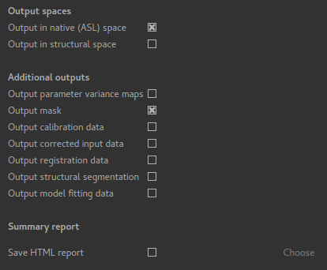

ASL Output Tab
==============

This tab controls the output that will be produced.

Output data spaces
^^^^^^^^^^^^^^^^^^

Standard data item outputs
--------------------------

The following data items are output:

  - ``perfusion`` Tissue perfusion
  - ``arrival`` Inferred arterial transit time
  - ``modelfit`` Model prediction for comparison with the tag-control differenced data

If ``Fix label duration`` is *not* specified:

  - ``duration`` Inferred Label duration

If ``Fix arterial transit time`` is *not* specified:

  - ``arrival`` Inferred arterial transit time

If ``Include macro vascular component`` *is* specified:

  - ``aCBV`` Macrovascular component
  
If ``Allow uncertainty in T1 values`` *is* specified:

  - ``mean_T_1`` Tissue T1 value
  - ``mean_T_1b`` Blood T1 value

If calibration is included, additional calibrated outputs ``perfusion_calib`` and ``aCBV_calib``
are also generated.

Data spaces
-----------

By default the output is produced in `native` ASL space (i.e. the same space as the input
ASL data). These outputs have the suffix ``_native``. In addition (or instead of) output
can be produced in structural space, in which case the outputs will have a suffix of ``_struc``.

Additional outputs
^^^^^^^^^^^^^^^^^^

Output parameter variance maps
------------------------------

The Bayesian modelling method used is able to output maps of the estimated parameter variance.
This gives a measure of how confident the values in the parameter maps are.
These outputs have the suffix ``_var``.

Output mask
-----------

If selected the mask used to perform the analysis will be output under the name ``mask_native``.

Output calibration data
-----------------------

The calibration data would include the reference mask used in reference region calibration and
the voxelwise M0 image in voxelwise calibration. These outputs have the suffix ``_calib``.

Output corrected input data
---------------------------

This option outputs corrected versions of the input data (ASL and calibration) after 
motion correction, distortion correction, etc. have been performed. These outputs have the
suffix ``_corr``.

Output registration data
------------------------

This option outputs data used as the reference for registration with the
suffix ``_ref``.

Output structural segmentation
------------------------------

This option outputs the brain extracted and segmented (partial volume and mask) maps from
the structural data. These outputs have the suffix ``_struc``.

Output model fitting data
-------------------------

This option outputs the full output from the model fitting step. These outputs have the
suffix ``_fitting``.

.. warn::
    Model fitting is a two-stage multi-step process with a number of intermediate output data
    files. Selecting this option will generate a large number of output data sets!
    
Summary report
^^^^^^^^^^^^^^

A summary report in HTML format can be generated - if required you need to select this option
and choose an output directory:

