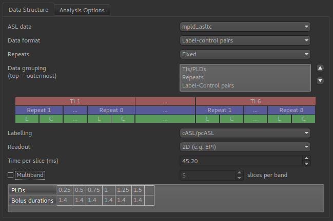
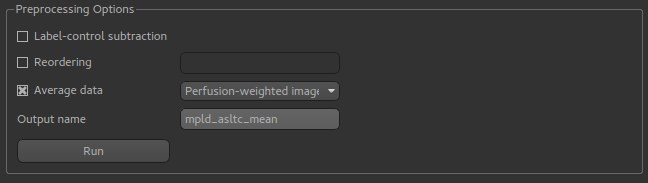
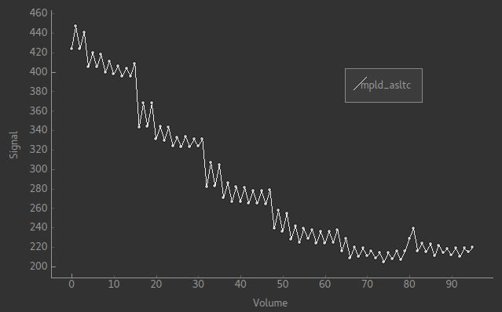
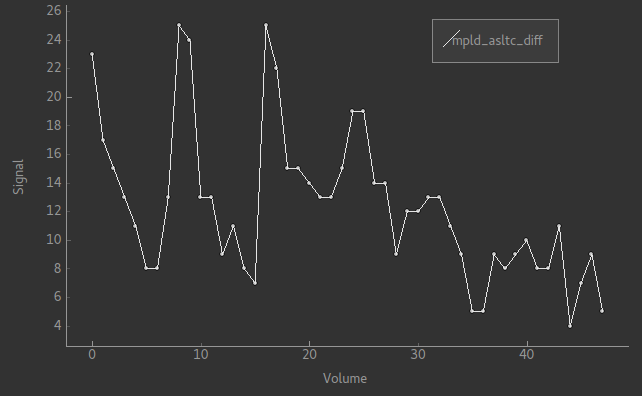
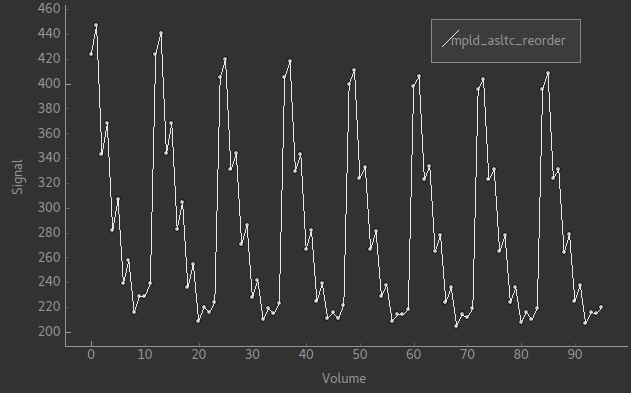
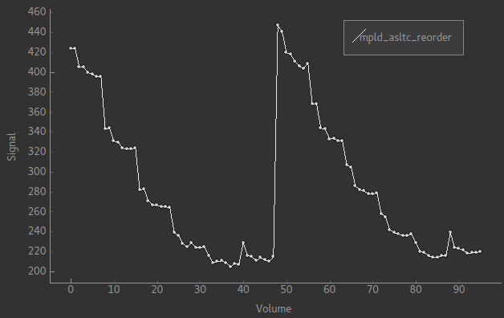
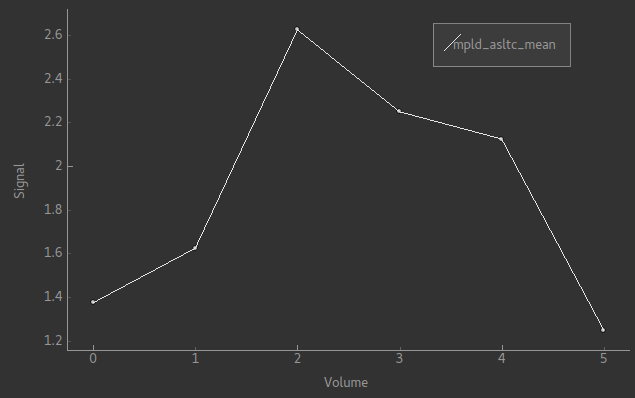
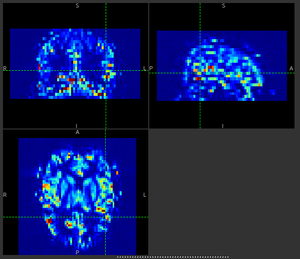

ASL Preprocessing
=================

- *Widgets -> ASL -> Preprocess*

This widget provides simple preprocessing for ASL data.

ASL data structure
------------------

The structure of the ASL data is defined using the `ASL structure widget <asl_struc.html>`_

This example shows a multi-PLD PCASL data set with 2D readout.

Preprocessing options
---------------------

Pre-processing options are shown below the structure definition:

``Label-control subtraction`` will convert the data into differenced ASL data, passing on other details of the ASL structure
(PLDs, etc) to the output data set. If we view the raw signal using the ``Voxel Analysis`` widget we see a pattern like this:

The alternating pattern of the tag-control pairs is clearly visible. After differencing we see the following:

This is harder to read as the data is quite noisy, however note that there are half the number of volumes and the alternating
pattern is gone.

``Reordering`` changes the grouping order of the ASL data. The re-ordering string consists of a sequence of characters with the 
innermost grouping first. ``p`` represents Label-Control pairs, (capital ``P`` is used for Control-Label pairs), ``r`` is for repeats
and ``t`` is for TIs/PLDs. For example, the data above is in order ``prt`` and in the signal pattern above you can see a series of repeat measurements at six PLDs.

Changing the order to ``ptr`` will keep the tag/pair alternation but change the data to repeats of sets of all six PLDs:

If you prefer, you could have the original ordering but all the tags first and all the control images afterwards. That would be 
an ordering of ``rtp`` and looks like this:

``Average data`` can do one of two things. It can take the mean over the repeats at each PLD, resulting in a new multi-PLD data set.
This enables the ASL signal to be seen more clearly in multi-repeat data, for example this is a typical signal from the data
shown above:

This shows the ASL signal more clearly than the noisy differenced data signal shown above.

Alternatively, for a multi-PLD data set you can take the mean over all PLDs as well to generate a ``Perfusion-weighted image``. This
is usually similar to the output from model fitting and provides a quick way to check the perfusion. The result of this operation
is always a single-volume image. For the data above it looks as follows:

This can be compared to the output shown at the bottom of the `ASL model fitting <asl.html>`_ page.

