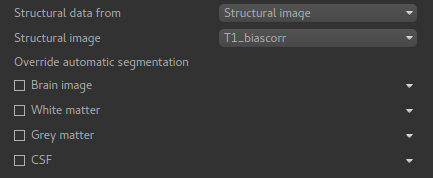
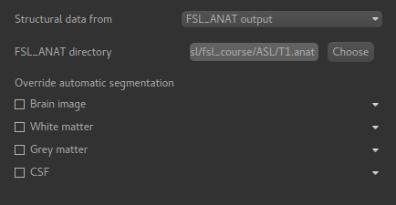

ASL Structural Data Tab
=======================

Providing structural data enables the pipeline to do the following:

 - Generate a higher quality mask by using the more detailed structural image to identify the brain
 - Output data in structural space, enabling it to be easily overlaid onto the structural image
 - Automatically segment the structure into tissue types for use in reference region calibration and
   partial volume correction.

Structural data may be provided in two ways - as a structural image (e.g. T1 weighted) or as an
output folder from the ``FSL_ANAT`` tool. The outcome should be essentially the same but 
using an ``FSL_ANAT`` folder is preferable if you have one because it means the segmentation
is already done which helps to speed up the pipeline.

In both cases you have the option to override the segementation by providing your own ROIs for
different tissue types.

Providing a structural image
----------------------------

Using an FSL_ANAT output folder
-------------------------------

