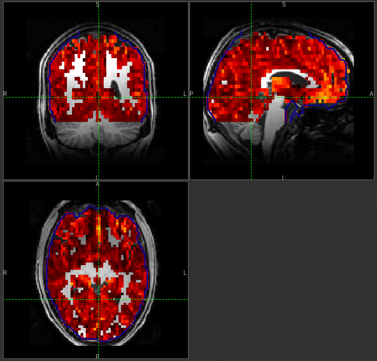
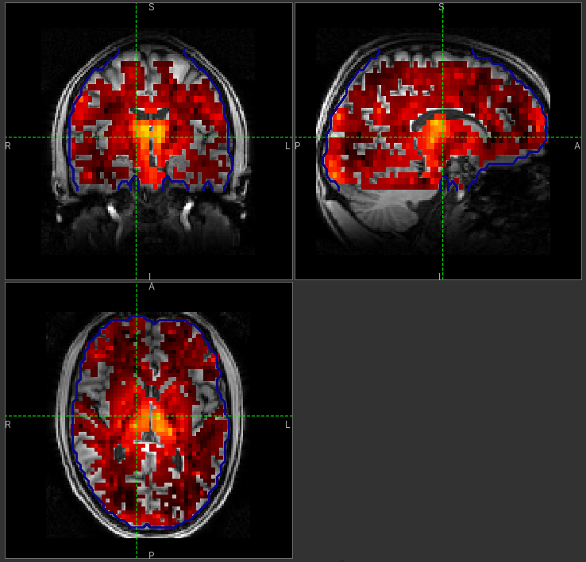
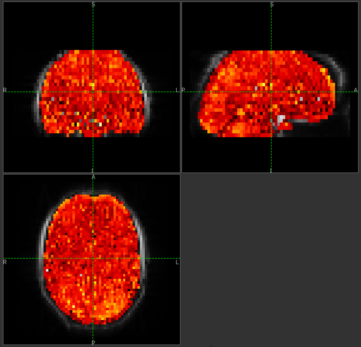
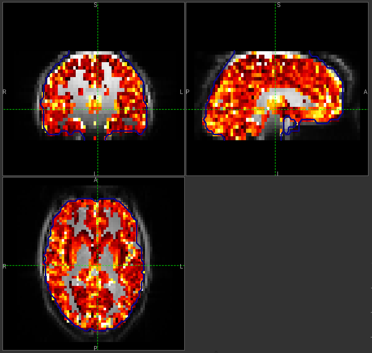
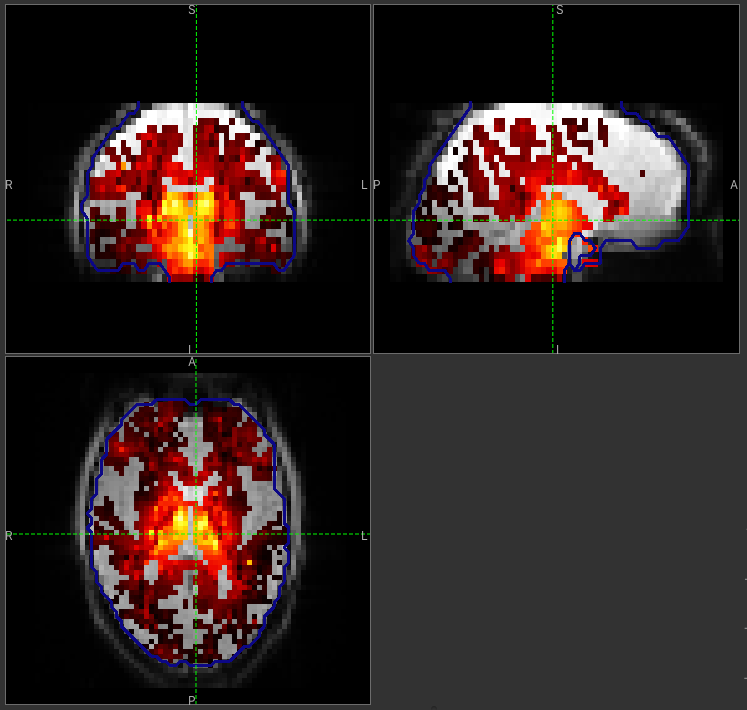

Arterial Spin Labelling Tutorial
================================

.. image:: screenshots/asl_tutorial_img.png
   :align: right

In this practical you will learn how to use the BASIL tools in FSL
to analyse ASL data, specifically to obtain quantitative images of
perfusion (in units of ml/100 g/min), as well as other haemodynamic
parameters. 

This tutorial describes the analysis using Quantiphyse - the same
analysis can be performed using the command line tool or the FSL
GUI. The main advantage of using Quantiphyse is that you can see
your input and output data and take advantage of any of the other
processing and analysis tools available within the application.

We will mention some of this additional functionality in 
Quantiphyse as we go, but do not be afraid to experiment with 
any of the built-in tools while you are following the tutorial.

This practical is based on the 
`FSL course practical session on ASL <https://fsl.fmrib.ox.ac.uk/fslcourse/lectures/practicals/ASLpractical/index.html>`_.
The practical is a shorter version of the examples that accompany the Primer: *Introduction to Neuroimaging
using Arterial Spin Labelling*. On the website for the primer you can find more examples.

http://www.neuroimagingprimers.org/examples/introduction-primer-example-boxes/

.. contents:: Contents
    :local:

Basic Orientation
-----------------

Before we do any data modelling, this is a quick orientation guide to Quantiphyse if you've 
not used it before. You can skip this section if you already know how the program works.

Start the program by typing ``quantiphyse`` at a command prompt, or clicking on the Quantiphyse
icon |qp| in the menu or dock.

.. |qp| image:: screenshots/qp_logo.png 
    :scale: 40%

.. image:: screenshots/main_window_empty.png

Loading some data
^^^^^^^^^^^^^^^^^

If you are taking part in an organized practical, the data required will be available in your home
directory, in the ``fsl_course/ASL`` folder. If not, the data can be can be downloaded from the FSL course site: 
https://fsl.fmrib.ox.ac.uk/fslcourse/ (Scroll down to the section entitled ``Data Files`` and choose the ASL 
data from the list of download links).

Start by loading the ASL data into Quantiphyse - use ``File->Load Data`` or drag and drop to load
the file ``spld_asltc.nii.gz``. In the ``Load Data`` dialog select ``Data``.

.. image:: screenshots/asl_tutorial_filetype.png

The data should look as follows:

.. image:: screenshots/main_window_basic.png

Image view
^^^^^^^^^^

The left part of the window contains three orthogonal views of your data.

 - Left mouse click to select a point of focus using the crosshairs
 - Left mouse click and drag to pan the view
 - Right mouse click and drag to zoom
 - Mouse wheel to move through the slices
 - Double click to 'maximise' a view, or to return to the triple view from the maximised view.

View and navigation controls
^^^^^^^^^^^^^^^^^^^^^^^^^^^^

Just below the viewer these controls allow you to move the point of focus and also change 
the view parameters for the current ROI and overlay.

Widgets
^^^^^^^

The right hand side of the window contains 'widgets' - tools for analysing and processing data.
Three are visible at startup:

 - ``Volumes`` provides an overview of the data sets you have loaded
 - ``Data statistics`` displays summary statistics for data set
 - ``Voxel analysis`` displays timeseries and overlay data at the point of focus

Select a widget by clicking on its tab, just to the right of the image viewer. 

More widgets can be found in the ``Widgets`` menu at the top of the window. The tutorial
will tell you when you need to open a new widget.

For a slightly more detailed introduction, see the :ref:`getting_started` section of the
User Guide.

Perfusion quantification using Single PLD pcASL
-----------------------------------------------

In this section we will generate a perfusion image using the simplest analysis possible on
the simplest ASL data possible.

Click on the ``Voxel Analysis`` widget - it is visible by default to the right of the main image view, 
then click on part of the cortex. You should see something similar to this:

.. image:: screenshots/asl_tutorial_signal_spld.png

You can see that the data has a zig-zag low-high pattern - this reflects the label-control repeats
in the data. Because the data was all obtained at a single PLD the signal is otherwise fairly constant.

A perfusion weighted image
^^^^^^^^^^^^^^^^^^^^^^^^^^

Open the ``Widgets->ASL->ASL Data Processing`` widget. We do not need to set all the details of the 
data set yet, however note that the data format is (correctly) set as ``Label-control pairs``. 

.. image:: screenshots/asl_tutorial_preproc_tc.png

Click on the ``Generate PWI`` button. This performs label-control subtraction and averages the
result over all repeats. The result is displayed as a colour overlay, which should look like a 
perfusion image:

.. image:: screenshots/asl_tutorial_pwi_spld.png

We can improve the display a little by adjusting the colour map. Find the overlay view options below 
the main image view:

.. image:: screenshots/asl_tutorial_overlay_opts.png

Next to the ``Color Map`` option (which you can change if you like!) there is a levels button |levels|
which lets you change the min and max values of the colour map. Set the range from ``0`` to ``10``
and select ``Values outside range`` to ``Clamped``. 

.. |levels| image:: screenshots/overlay_levels.png 

.. image:: screenshots/asl_tutorial_cmap_range.png

Then click ``Ok``. The perfusion weighted image should now be clearer:

You could also have modified the colour map limits by dragging the colourmap range widget directly - 
this is located to the right of the image view. You can drag the upper and lower limits with the
left button, while dragging with the right button changes the displayed scale. You can also 
customize the colour map by clicking on the colour bar with the right button.

.. warning::
    Dragging the colourmap is a little fiddly due to a GUI bug. Before trying to adjust the levels, 
    drag down with the **right** mouse button briefly on the colour bar. This unlocks the automatic
    Y-axis and will make it easier to drag on the handles to adjust the colour map.
    

    Colour map widget

Model based analysis
^^^^^^^^^^^^^^^^^^^^

This dataset used pcASL labeling and we are going to start with an analysis which follows as closely 
as possible the recommendations of the ASL Consensus Paper [1]_ (commonly called the 'White Paper')
on a good general purpose ASL acquisition, although we have chosen to use a 2D multi-slice readout 
rather than a full-volume 3D readout.

Looking at the ``ASL data processing`` widget we used to generate the PWI, you can see that this
is a multi-page widget in which each tab describes a different aspect of the analysis pipeline. 
We start by reviewing the information on the first page which describes our ASL data acquisition:

.. image:: screenshots/asl_tutorial_datatab_spld.png

Most of this is already correct - we have label-control pairs and the data grouping does not
matter for single PLD data (we will describe this part of the widget later in the multi-PLD
analysis). The labelling method is correctly set as ``cASL/pcASL``. However
we have a 2D readout with 45.2ms between slices, so we need to change the ``Readout`` option
to reflect this. When we select a 2D readout, the option to enter the slice time appears
automatically.

.. image:: screenshots/asl_tutorial_readout.png

The bolus duration of 1.8s is correct, however we have used a post-labelling delay of 1.8s
in this data, so enter ``1.8`` in the ``PLDs`` entry box.

.. image:: screenshots/asl_tutorial_plds_single.png

(Simple) Perfusion Quantification
^^^^^^^^^^^^^^^^^^^^^^^^^^^^^^^^^

In this section we invert the kinetics of the ASL label delivery to fit a perfusion image, and 
use the calibration image to get perfusion values in the units of ml/100g/min.

Firstly, on the ``Corrections`` tab, we will uncheck ``Motion Correction`` which is enabled by 
default:

.. image:: screenshots/asl_tutorial_corr_none.png

For this run we will skip the ``Structural data`` tab, and instead move on to ``Calibration``. 
To use calibration we first need to load the calibration image data file from the same folder containing the ASL
data - again we can use drag/drop or the ``File->Load Data`` menu option to load the following file:

 - ``aslcalib.nii.gz`` - Calibration (M0) image

On the ``Calibration`` tab we set the calibration method as ``Voxelwise`` which is recommended
in the white paper. We also need to select the calibration image we have just loaded: ``aslcalib``.
The TR for this image was 4.8s, so click on the ``Sequence TR`` checkbox
and set the value to 4.8. Other values can remain at their defaults.

.. image:: screenshots/asl_tutorial_calib_spld.png

On the ``Analysis`` we select ``Enable white paper mode`` at the bottom which sets some default
values to those recommended in the White paper.

.. image:: screenshots/asl_tutorial_analysis_spld.png

We will not change the defaults on the ``Output`` tab yet, but feel free to view the options
available.

We are now set up to run the analysis - but before you do, check the green box at the bottom of
the widget which reports where it thinks FSL is to be found. If the information does not seem
to be correct, click the ``Change`` button and select the correct location of your FSL 
installation.

.. image:: screenshots/asl_tutorial_fsldir.png

Finally click ``Run`` at the bottom to run the analysis. You can click the ``View Log`` button 
to view the progress of the analysis which should only take a few minutes. 

.. image:: screenshots/asl_tutorial_running_spld.png

.. note::
    While you are waiting
    you can read ahead and even start changing the options in the GUI ready for the next analysis that 
    we want to run.

Once the analysis had completed, some new data items will be available. You can display them either
by selecting them from the ``Overlay`` menu below the image display, or by clicking on the
``Volumes`` widget and selecting them from the list. The new data items are:

 - ``perfusion_native`` - Raw (uncalibrated) perfusion map 
 - ``perfusion_calib_native`` - Calibrated perfusion data in ml/100g/min
 - ``mask_native`` - An ROI (which appears in the ROI selector under the image view) which represents
   the region in which the analysis was performed.

The images may be clearer if we modify the view style for the ROI from ``Shaded`` to ``Contour``
(in the ROI options box underneath the image view). This replaces the translucent red mask with
an outline: 

.. image:: screenshots/asl_tutorial_roi_contour.png

The ``perfusion_calib_native`` image should look similar to the perfusion weighted image we created
initially, however the data range reflects the fact that it is in physical units in which average GM
perfusion is usually in the 30-50 range. To get a clear visualisation set the color map range to 0-150
using the Levels button |levels| as before. You can also select ``Only in ROI`` as the ``View`` option
just above this so we only see the perfusion map within the selected ROI. The result should look 
something like this:

.. image:: screenshots/asl_tutorial_perfusion_calib_spld.png

Improving the Perfusion Images from single PLD pcASL
----------------------------------------------------

The purpose of this practical is essentially to do a better job of the analysis we did above, 
exploring more of the features of the GUI including things like motion and distortion correction.

Motion and Distortion correction
^^^^^^^^^^^^^^^^^^^^^^^^^^^^^^^^

First we need to load an additional data file:

 - ``aslcalib_PA.nii.gz`` - this is a 'blipped' calibration image - identical to ``aslcalib``
   apart from the use of posterior-anterior phase encoding (anterior-posterior was used in the 
   rest of the ASL data). This is provided for distortion correction.

Go back to the GUI which should still be setup from the last analysis you did.

On the ``Corrections`` tab, we will check ``Motion Correction`` to enable it, and 
and click on the ``Distortion Correction`` checkbox to show distortion correction options. 
We select the distortion correction method as ``Phase-encoding reversed calibration``, select 
``y`` as the phase encoding direction, and ``0.95`` as the echo spacing in ms (also known as the 
dwell time). Finally we need to select the phase-encode reversed image as ``aslcalib_PA`` which 
we have just loaded:

.. image:: screenshots/asl_tutorial_corr_spld.png

On the ``Analysis`` tab, make sure you have ``Spatial regularization`` selected 
(it is by default). This will reduce the appearance of noise in the final perfusion image using 
the minimum amount of smoothing appropriate for the data.

In order to compare with the previous analysis we might want the output to have a different name.
To do this, on the ``Output`` tab, select the ``Prefix for output data names`` checkbox and
provide a short prefix in the text box, e.g. ``new_``.

.. note::
    As an alternative to using a prefix, you can also rename data items from the ``Volumes`` widget which is
    visible by default. Click on a data set name in the list and click ``Rename`` to give
    it a new name.

Now click ``Run`` again.

For this analysis we are still in 'White Paper' mode. Specifically this means we are using the 
simplest kinetic model, which assumes that all delivered blood-water has the same T1 as that of 
the blood and that the Arterial Transit Time should be treated as 0 seconds.

As before, the analysis should only take a few minutes, slightly longer this time due to the 
distortion and motion correction. Like the last exercise you might want to skip ahead and start 
setting up the next analysis.

The output will not be very different, but if you switch between the old and new
versions of the ``perfusion_calib_native`` data set you should be able to see slight stretching in
the anterior portion of the brain which is the outcome of distortion correction. 

To do this
select the ``Volumes`` widget and in the data list click on the left hand box next to the data 
item you want to see. An 'eye' icon will appear here |eye| indicating that this data set is 
now visible. Switch between ``new_perfusion_calib_native`` and ``perfusion_calib_native`` to 
see the different - it helps if you set the colour map range the same for both data sets.

.. image:: screenshots/asl_tutorial_select_volume.png

.. |eye| image:: screenshots/overlay_visible.png 

This data does not have a lot of motion in it so the motion correction is difficult to identify.

Making use of Structural Images
^^^^^^^^^^^^^^^^^^^^^^^^^^^^^^^

Thus far, all of the analyses have relied purely on the ASL data alone. However, often you will 
have a (higher resolution) structural image in the same subject and would like to use this as well, 
at the very least as part of the process to transform the perfusion images into some template space.
We can provide this information on the ``Structural Data`` tab.

You can either load
a structural (T1 weighted) image into Quantiphyse and select ``Structural Image`` as the 
source of structural data, or if you have already processed your structural data with ``FSL_ANAT``
you can point the analysis at the output directory. We will use the second method as it enables
the analysis to run faster. On the ``Structural Data`` tab, we select ``FSL_ANAT`` output and chooses
the location of the FSL_ANAT output directory (``T1.anat``):

.. note::
    If a simple structural image was provided instead of an ``FSL_ANAT`` output folder, 
    the ``FAST`` segmentation tool is automatically run to obtain partial volume estimates.
    This adds considerably to the run-time so it's generally recommended to run ``FSL_ANAT``
    separately first.

.. image:: screenshots/asl_tutorial_struc_spld.png

If we want to output our data in structural space (so it can be easily overlaid onto the structural
image), click on the ``Output`` tab and check the option ``Output in structural space``:

.. image:: screenshots/asl_tutorial_output_struc.png

This analysis will take somewhat longer overall (potentially 15-20 mins), the extra time is taken 
up doing careful registration between ASL and structural images. Thus, this is a good point to 
keep reading on and leave the analysis running.

You will find some new data sets in the overlay list, in particular:

 - ``perfusion_calib_struc`` - Calibrated perfusion in structural space

This is the calibrated perfusion image in high-resolution structural space. It is nice to view
it in conjunction with the structural image itself. To do this, load the ``T1.anat/T1.nii.gz``
data file and select ``Set as main data`` when loading it. Then select ``perfusion_calib_struc``
from the ``Overlay`` menu and select ``View`` as ``Only in ROI``:

.. image:: screenshots/asl_tutorial_perfusion_calib_struc.png

You can move the ``Alpha`` slider under the overlay selector to make the perfusion map more or less
transparent and verify that the perfusion map lines up with the structural data.

Different model and calibration choices
^^^^^^^^^^^^^^^^^^^^^^^^^^^^^^^^^^^^^^^

So far to get perfusion in units of ml/100g/min we have used a voxelwise division of the relative
perfusion image by the (suitably corrected) calibration image - so called 'voxelwise' calibration. 
This is in keeping with the recommendations of the ASL 
White Paper for a simple to implement quantitative analysis. However, we could also choose to 
use a reference tissue to derive a single value for the equilibrium magnetization of arterial 
blood and use that in the calibration process instead - the so-called 'reference region' method.

Go back to the analysis you have already set up. We are now going to turn off 'White Paper' mode, 
this will provide us with more options to get a potentially more accurate analysis. To do this 
return to the 'Analysis' tab and deselect the 'White Paper' option. You will see that the 
'Arterial Transit Time' goes from 0 seconds to 1.3 seconds (the default value for pcASL in BASIL 
based on our experience with pcASL labeling plane placement) and the 'T1' value (for tissue) is 
different to 'T1b' (for arterial blood), since the Standard (aka Buxton) model for ASL kinetics 
considers labeled blood both in the vasculature and the tissue.

.. image:: screenshots/asl_tutorial_analysis_spld2.png

Now that we are not in 'White Paper' mode we can also change the calibration method. On the 
``Calibration`` tab, change the ``Calibration method`` to ``Reference Region``. 

.. image:: screenshots/asl_tutorial_calib_refregion.png

The default values will automatically identify CSF in the brain ventricles and use it to derive
a single calibration M0 value with which to scale the perfusion data. However this is quite
time consuming, so we will save ourselves the bother and provide a ready-made mask which identifies
pure CSF voxels. To do this, first load the dataset ``csfmask.nii.gz`` and be sure to identify
it as an ROI (*not* Data).

.. image:: screenshots/asl_tutorial_load_roi.png

.. note::
    If you incorrectly load an ROI as a data set you can switch it to an ROI on the
    ``Volumes`` widget which is visible by default. Select the data from the list and
    click ``Toggle ROI``.

Then select  ``Custom reference ROI`` and choose ``csfmask`` from the list:

.. image:: screenshots/asl_tutorial_calib_roi.png

As before you may want to add an output name prefix so you can compare the results. Then click
``Run`` once more.

The resulting perfusion images should look very similar to those produced using the 
voxelwise calibration, and the absolute values should be similar too. For this, and many 
datasets, the two methods are broadly equivalent. 

Partial Volume Correction
^^^^^^^^^^^^^^^^^^^^^^^^^

Having dealt with structural image, and in the process obtained partial volume estimates, we 
are now in a position to do partial volume correction. This does more than simply attempt to 
estimate the mean perfusion within the grey matter, but attempts to derive and image of gray 
matter perfusion directly (along with a separate image for white matter).

This is very simple to do. First ensure that you have provided structural data (i.e. the FSL_ANAT output)
on the ``Structure`` tab. The partial volume estimates produced by fsl_anat (in fact they are done using 
fast) are needed for the correction. On the ``Analysis`` tab, select ``Partial Volume Correction``. 

.. image:: screenshots/asl_tutorial_pvc_on.png

To run the analysis you would simply click ``Run`` again, however this will take **a lot longer to run**.
If you'd prefer not to wait, you can find the results of this analysis already completed in the
directory ``ASL/oxasl_spld_pvout``. 

In this results directory you will still find an analysis performed without partial volume correction
in ``native_space`` as before. The results of partial volume correction can be found in ``native_space/pvcorr``. 
In this directory the output perfusion data ``perfusion_calib.nii.gz`` is now an estimate of perfusion 
**only in gray matter**. It has been joined by a new set of images for 
the estimation of white matter perfusion, e.g., ``perfusion_wm_calib.nii.gz``. 

It may be more helpful to look at ``perfusion_calib_masked.nii.gz`` (and the equivalent 
``perfusion_wm_calib_masked.nii.gz``) since this has been masked to include only voxels 
with more than 10% gray matter (or white matter), i.e., voxels in which it is reasonable 
to interpret the gray matter (white matter) perfusion values - shown below.

    GM perfusion (masked to include only voxels with >= 10% GM)

    WM perfusion (masked to include only voxels with >= 10% WM)

Perfusion Quantification (and more) using Multi-PLD pcASL
---------------------------------------------------------

The purpose of this exercise is to look 
at some multi-PLD pcASL. As with the single PLD data we can obtain perfusion images, but now we 
can account for any differences in the arrival of labeled blood-water (the arterial transit time, 
ATT) in different parts of the brain. As we will also see we can extract other interesting parameters, 
such as the ATT in its own right, as well as arterial blood volumes.

The data
^^^^^^^^

.. note::
    If you have accumulated a lot of data sets you might want to choose ``File->Clear all data``
    from the menu and start from scratch again. Note that you will need to re-load the calibration
    and other input data. You can also delete data sets from the ``Volumes`` widget.

The data we will use in this section supplements the single PLD pcASL data above, adding multi-PLD 
ASL in the same subject (collected in the same session). This dataset used the same pcASL labelling, 
but with a label duration of 1.4 seconds and 6 post-labelling delays of 0.25, 0.5, 0.75, 1.0, 1.25 
and 1.5 seconds.

The ASL data file you will need to load is:

 - ``mpld_asltc.nii.gz``
 
The label-control ASL series containing 96 volumes. Each PLD was repeated 8 times, thus there are 
16 volumes (label and control paired) for each PLD. The data has been re-ordered from the way it 
was acquired, such that all of the measurements from each PLD have been grouped together - it is 
important to know this data ordering when doing the analysis. 

Perfusion Quantification
^^^^^^^^^^^^^^^^^^^^^^^^

Going back to the ASL data processing widget, we first go back to the `Asl Data` tab page 
and select our new ASL data from the choice at the top:

.. image:: screenshots/asl_tutorial_datasel_mpld.png

We need to enter the 6 PLDs in the ``PLDs`` entry box - these can be separated by spaces or
commas. We also change the label duration to 1.4s:

.. image:: screenshots/asl_tutorial_plds_mpld.png

As we noted earlier, in this data all of the measurements at the same PLD are grouped together. 
This is indicated by the ``Data grouped by`` option which defaults (correctly in this case) to
``TIs/PLDs``. Below this selection there is a graphical illustration of the structure of the data 
set:

.. image:: screenshots/asl_tutorial_grouping_mpld.png

The data set volumes go from left to right. Starting with the top line (red) we see that the
data set consists of 6 TIs/PLDs, and within each PLD are 8 repeats (blue), and within each 
repeat there is a label and a control image.

Below the grouping diagram, there is a visual preview of how well the *actual* data signal matches
what would be expected from this grouping. The actual data signal is shown in green, the expected
signal from the grouping is in red, and here they match nicely, showing that we have chosen the
correct grouping option.

.. image:: screenshots/asl_tutorial_signal_right.png

If we change the ``Data Grouped by`` option to ``Repeats`` (incorrect) we see that the actual
and expected signal do not match up:

.. image:: screenshots/asl_tutorial_signal_wrong.png

We can get back to the correct selection by clicking ``Auto detect`` which chooses the grouping
which gives the best match to the signal.

Another way to determine the data ordering is to open the ``Widget->Analysis->Voxel Analysis`` 
widget and select a GM voxel, which should clearly shows 6 groups of PLDs (rather than 8 groups 
of repeats):

.. image:: screenshots/asl_tutorial_voxel_analysis_mpld.png

Each of the six roughly horizontal section of the signal represents the repeats at a given PLD and 
again the zig-zag pattern of the label-control images within each PLD are visible.

The remaining options are the same as for the single-PLD example:

 - Labelling - ``cASL/pcASL``
 - Readout - ``2D multi-slice`` with ``Time per slice`` of 45.2ms

We can use the same structural and calibration data as for the previous example because they
are the same subject. The analysis pipeline will correct for any misalignment between the
calibration image and the ASL data. We can also keep the distortion correction setup from
before.

This analysis shouldn't take a lot longer than the equivalent single PLD analysis, but feel
free to skip ahead to the next section whilst you are waiting.

The results from this analysis should look similar to that obtained for the single 
PLD pcASL. That is reassuring as it is the same subject. The main difference is the 
a data set named ``arrival``. If you examine this image you should find a pattern of 
values that tells you the time it takes for blood to transit between the labeling and 
imaging regions. You might notice that the ``arrival`` image was present even in the 
single-PLD results, but if you looked at it contained a single value - the one set 
in the Analysis tab - which meant that it appeared blank in that case.

    Arrival time of the labelled blood showing delayed arrival to the posterior regions of the brain.

Arterial/Macrovascular Signal Correction
^^^^^^^^^^^^^^^^^^^^^^^^^^^^^^^^^^^^^^^^

In the analysis above we didn't attempt to model the presence of arterial (macrovascular) signal. 
This is fairly reasonable for pcASL in general, since we can only start sampling some time after
the first arrival of labeled blood-water in the imaging region. However, given we are using shorter
PLD in our multi-PLD sampling to improve the SNR there is a much greater likelihood of arterial 
signal being present. Thus, we might like to repeat the analysis with this component included in 
the model.

Return to your analysis from before. On the ``Analysis`` tab select ``Macro vascular component``. 
Click ``Run`` again.

The results should be almost identical to the previous run, but now we also gain some 
new data: ``aCBV_native`` and ``aCBV_calib_native``.

Following the convention for the perfusion 
images, these are the relative and absolute arterial (cerebral) blood volumes respectively. If 
you examine one of these and focus on the more inferior slices you should see a pattern of higher 
values that map out the structure of the major arterial vasculature, including the Circle of Willis. 
A colour map range of 0-100 helps with this, as well as clamping the colour map for out of range
data:

This finding of an arterial contribution in some voxels results in a correction to the perfusion 
image - you may now be able to spot that in the same slices where there was some evidence for 
arterial contamination of the perfusion image before that has now been removed.

Partial Volume Correction
^^^^^^^^^^^^^^^^^^^^^^^^^

In the same way that we could do partial volume correction for single PLD pcASL, we can do this 
for multi-PLD. If anything partial volume correction should be even better for multi-PLD ASL, as 
there is more information in the data to separate grey and white matter perfusion.

Just like the single PLD case we will require structural information, entered on the ``Structure`` 
tab. On the ``Analysis`` tab, select ``Partial Volume Correction``.

.. image:: screenshots/asl_tutorial_pvc_on.png

Again, this analysis will not be very quick and so you might not wish to click ``Run`` right now.

You will find the results of this analysis already completed for you in the directory
``~/fsl_course_data/ASL/oxasl_mpld_pvout``. This results directory contains, as a further subdirectory, 
``pvcorr``, within the ``native_space`` subdirectory, the partial volume corrected results: gray matter 
(``perfusion_calib.nii.gz etc``) and white matter perfusion (``perfusion_wm_calib.nii.gz etc``) maps. 

    GM perfusion (masked to include only voxels with >= 10% GM)

    WM perfusion (masked to include only voxels with >= 10% WM)

Alongside these there are also gray and white matter ATT maps (``arrival`` and ``arrival_wm`` respectively). 
The estimated maps for the arterial component (``aCBV_calib.nii.gz`` etc) are still present in the 
``pvcorr`` directory. Since this is not tissue specific there are not separate gray and white matter 
versions of this parameter.

Additional useful options
-------------------------

A full description of the options available in the ASL processing widget are given in the
reference documentation, however, here are a few in particular that you may wish to make use of:

Save copy of output data
^^^^^^^^^^^^^^^^^^^^^^^^

You can of course save the output data from your analysis using ``File->Save Current Data``
however it's often useful to have all the output saved automatically for you. By clicking
on this option (underneath the ``Run`` button) and choosing an output folder, this will
be done.

.. image:: screenshots/asl_tutorial_save_data.png

Generate HTML report
^^^^^^^^^^^^^^^^^^^^

This option is available on the ``Output`` tab and will generate a summary report of the
whole pipeline in the directory that you specify. To get this you will need to select
the checkbox and enter or choose a directory to store the report in.

.. image:: screenshots/asl_tutorial_report_dir.png

Quantiphyse will attempt to open the report in your default web browser when the pipeline 
has completed, but if this does not happen you can navigate to the directory yourself and 
open the ``index.html`` file.

Below is an example of the information included in the report:

.. image:: screenshots/asl_tutorial_report.png

The links are arranged in the order of the processing steps and each link leads to
a page giving more detail on this part of the pipeline. For example here's it's 
summary of the motion correction step for the single-PLD data:

.. image:: screenshots/asl_tutorial_report_moco.png

This shows that there's not much motion generally and no particularly `bad` volumes.

If we click on the perfusion image link we get a sample image and some averages
in GM and WM. This is useful to check that the analysis seems to have worked
and the numbers are in the right range:

.. image:: screenshots/asl_tutorial_report_perfusion.png

References
----------

.. [1] Alsop, D. C., Detre, J. A., Golay, X. , Günther, M. , Hendrikse, J. , Hernandez‐Garcia, L. , 
      Lu, H. , MacIntosh, B. J., Parkes, L. M., Smits, M. , Osch, M. J., Wang, D. J., Wong, E. C. 
      and Zaharchuk, G. (2015), Recommended implementation of arterial spin‐labeled perfusion MRI 
      for clinical applications: A consensus of the ISMRM perfusion study group and the European 
      consortium for ASL in dementia. Magn. Reson. Med., 73: 102-116. doi:10.1002/mrm.25197
