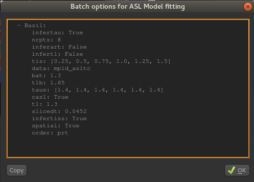
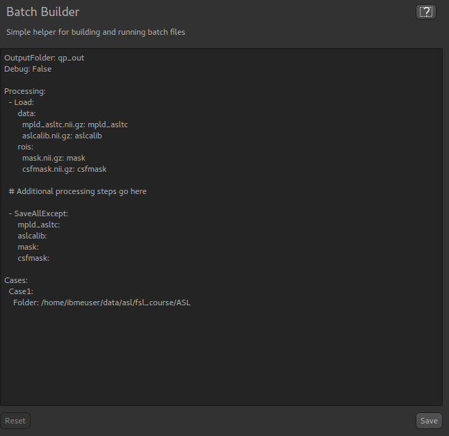
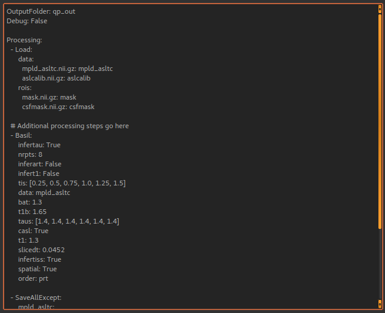
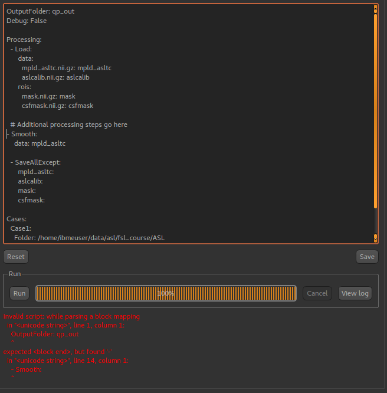

Batch processing
================

Often it is useful to be able to run a set of analysis / processing steps on a whole set of files, without
needing to manually load and save the files separately within the GUI. Quantiphyse provides a simple batch 
processing system which gives access to most of the processing steps available from the GUI.

Batch files are written in YAML syntax. Below is a simple example.

::

    # Example config file for running Fabber

    OutputFolder: out
    Debug: True
    
    Processing:
        - Load:
            data:
              mri.nii:
            rois:
              roi.nii: mask

        - Fabber:
            method: vb
            max-iterations: 30
            model:  poly
            noise: white
            degree: 2 
            save-mean:

        - Save:
            mean_c0:
            mean_c1:
            mean_c2:
            mask:
            mri:

    Cases:
        Subj0001:
            InputFolder:   c:\mydata\0001
        Subj0003:
            InputFolder:   c:\mydata\0003
        Subj0003:
            InputFolder:   c:\mydata\0003

The batch file is divided into three main sections. First we have statements to set up default options which
will apply to all cases. In this example we are putting all output data in the ``out`` folder and enabling Debug
messages.

The next section defines a series of processing steps. This usually starts with a Load statement and 
typically ends with Save. In this case we are loading a data file and an ROI which have the same filename
for each of our cases, however this file name is interpreted relative to the individual case folder so
different data is loaded each time. 

After loading the data we run the Fabber modelling tool. Options to provide to the tool are given here.

Finally we save the three output data sets generated by the Fabber process, as well as the main data and
ROI. These files will be saved in a subdirectory of the output folder specific to the case.

The third section of the batch file is a list of ``Cases``. The processing steps will be run separately on 
each case and the output saved in separate subdirectories of the output folder.

Output
------

The output from processing is stored in ``OutputFolder`` in a subdirectory named by the case identifier 
(e.g. ``Subj0001``). Processing steps may also generates a log file (e.g. ``Fabber.log``) in the same
subdirectory. In the above example we would expect the following output structure:

::

    out/Subj0001/mri.nii
    out/Subj0001/mean_c0.nii
    out/Subj0001/mean_c1.nii
    out/Subj0001/mean_c2.nii
    out/Subj0001/mask.nii
    out/Subj0001/Fabber.log
    out/Subj0002/mri.nii
    out/Subj0002/mean_c0.nii
    out/Subj0002/mean_c1.nii
    out/Subj0002/mean_c2.nii
    out/Subj0002/mask.nii
    out/Subj0002/Fabber.log
    out/Subj0003/mri.nii
    out/Subj0003/mean_c0.nii
    out/Subj0003/mean_c1.nii
    out/Subj0003/mean_c2.nii
    out/Subj0003/mask.nii
    out/Subj0003/Fabber.log

Overriding processing options within a case
-------------------------------------------

If a particular case needs options to be varied, you can override any of the toplevel options within the case block.
For example.

::

    Cases:
        Subj0001:
            InputFolder:   c:\mydata\0001
            # This case does not converge in 30 iterations
            Fabber:
                max-iterations: 100

Or, if one case is causing problems we might enable debug mode just for that case

::

    Debug: False

    Cases:
        Subj0005:
            InputFolder:   c:\mydata\0005
            # What's going on here?
            Debug: True

Multiple processing steps
-------------------------

The ``Processing`` block contains a list of steps, which will be performed in order. For example this
example performs motion correction on the main data, followed by PK modelling:

::

    Processing:
        - Moco:
            method: deeds
            replace-vol: True
            ref-vol: 14
        - PkModelling:
            model:      1
            fa:         30     # degrees
            tr:         5.0    # ms
            te:         2.2    # ms
            dt:         0.5    # temporal resolution (s)
            r1:         3.7    # T1 Relaxivity of contrast agent
            r2:         4.8    # T2 Relaxivity of contrast agent
            ve-thresh:  99.8   # Ktrans/kep percentile threshold
            tinj:       60     # Approximate injection time (s) 

Extras
------

*Extras* are data created by processing modules which are not voxel data, but can be saved to a text
file. They can be saved in the same way as data using the ``SaveExtras`` command. For example
the ``CalcVolumes`` process calculates the volume of each region of an ROI and outputs a table 
extra.

::

    OutputFolder: out

    Processing:
        - CalcVolumes:
            roi: mask
            output-name: roi_vols

        - SaveExtras:
            roi_vols:

    Cases:
        Subject1:
            Folder:   c:\Users\ctsu0221\build\data
            Load:
              data:
                 test_data.nii
              rois:
                 test_mask.nii : mask

In this case, the volume data will be saved in ``out/Subject1/roi_vols.txt``. In this case the
output is a tab-separated file which can be loaded into a spreadsheet.

Building batch files from the GUI
---------------------------------

It can be convenient to build up a batch process during the course of an interactive session, for example to try
out processing steps on a sample dataset and record the selected steps for later application to a group of
cases. Quantiphyse provides some basic features to facilitate this.

The `Batch Button`
~~~~~~~~~~~~~~~~~~

Many widgets support a `Batch Button` which is normally located in the top right corner, level with the widget title:

.. image:: screenshots/batch_button.png

Clicking the batch button pops up a window containing the batch file code for the analysis process currently defined by
the widget's GUI controls. For example, here is the result of clicking the batch button on the ASL model fitting widget
after we have set up a multi-PLD analysis:

The ``Copy`` button copies this code to the clipboard where it can be pasted into a batch script that you are creating
in a text editor, or using the ``Batch Builder`` widget (see below).

The `Batch Builder` widget
~~~~~~~~~~~~~~~~~~~~~~~~~~

This widget is available from the 'Utilities' menu and gives a simple editor for batch scripts.

When first opened, a skeleton batch script will be generated which loads all currently opened data files and then 
saves all new data created during the batch script (using the ``SaveAllExcept`` process). Here's an example after we've
loaded some ASL data:

This script will not do anything else, however we can copy batch code from widgets using the batch button and paste it
where the script says: ``# Additional processing steps go here``. So we could paste the ASL analysis code shown above:

This batch script can be ``Run`` to test it, and then we use ``Save`` to save it to a file when we're happy. You can add
cases and other processing as required. ``Reset`` will return to the 'skeleton' batch script with no custom processing.

The batch builder will indicate if your file contains any syntax errors, for example if we don't indent our processing steps
correctly:

One common issue is the use of tabs in a batch file which is not allowed but can cause difficult to interpret errors. Therefore,
if you use a tab character in the batch builder it will check and simply give a warning of ``Tabs detected``.

Future extensions
-----------------

The batch system may be extended in the future, however it is *not* intended to be a programming language
and basic facilities such as loops and conditionals will not be implemented. If your processing
pipeline is complex enough to require this the suggested method is to write the process in Python,
using Quantiphyse modules directly, for example::

    from quantiphyse.volumes import ImageVolumeManagement
    from quantiphyse.analysis.io import LoadProcess, SaveProcess

    ivm = ImageVolumeManagement()
    load = LoadProcess()
    load.run({"data" : {"mydata.nii" : "data"}, "rois" : {"mask_43.nii.gz" : "roi"}})

    # The std() method returns the data on the standard RAS grid derived from the main data
    numpy_data = ivm.data["data"].std()

    # ...Do my processing here which may involve running additional Quantiphyse processes
    #    alongside custom Python manipulations...

    ivm.add_data(output_data, name="output_data")
    save = SaveProcess()
    save.run({"output_data":"output_data.nii.gz"})

The processing modules available in the batch file are all included in the quantiphyse.analysis package. 
They all operate on data stored in the ImageVolumeManagement object. Data can be added to this object using 
the ``add_data`` and ``add_roi`` methods, which can take a Numpy array, provided it's dimensions are 
consistent with the current main data. This means that you can load data independently or generate it
programmatically if this is required.

.. warning::
    The volume management and analysis process APIs are *not* currently stable and you 
    will need to read the code to see how to use them - a stable API may be defined in the future for this 
    purpose.
