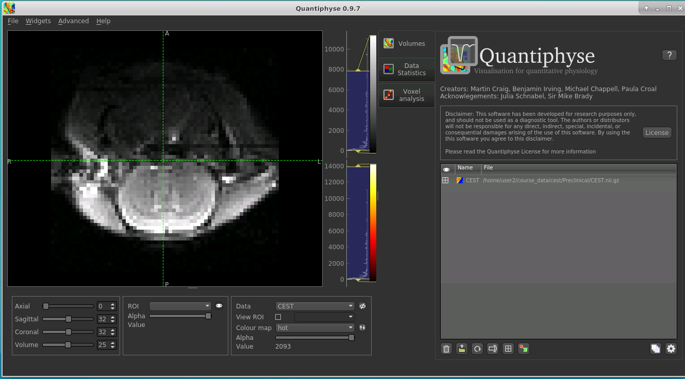
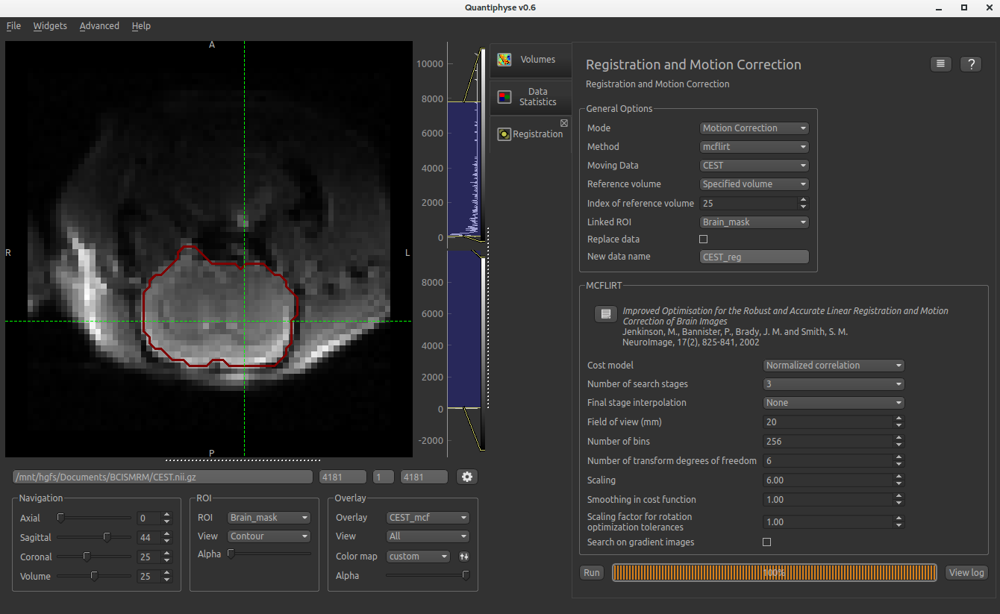
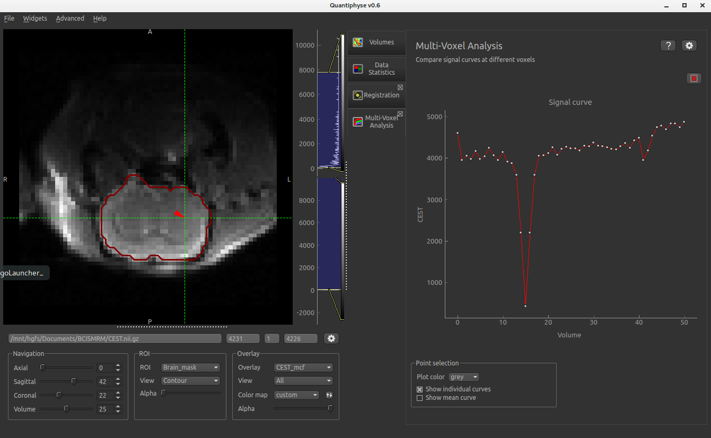
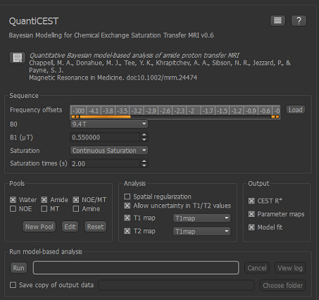
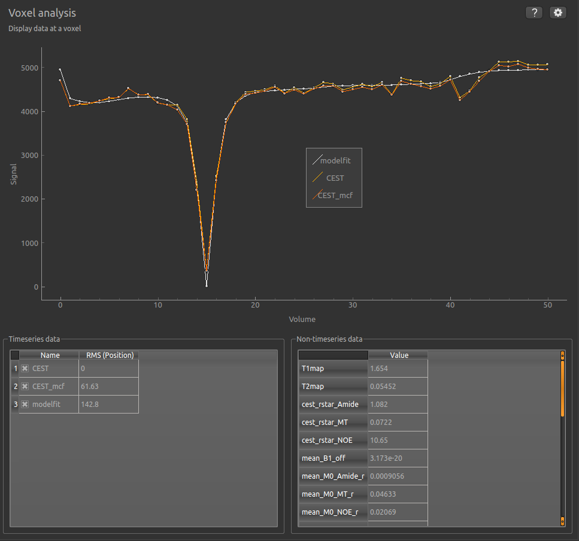
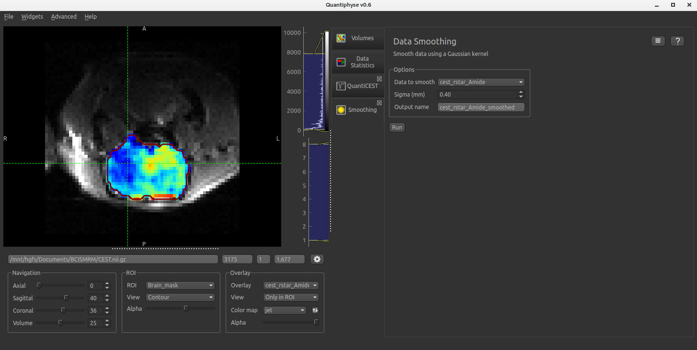
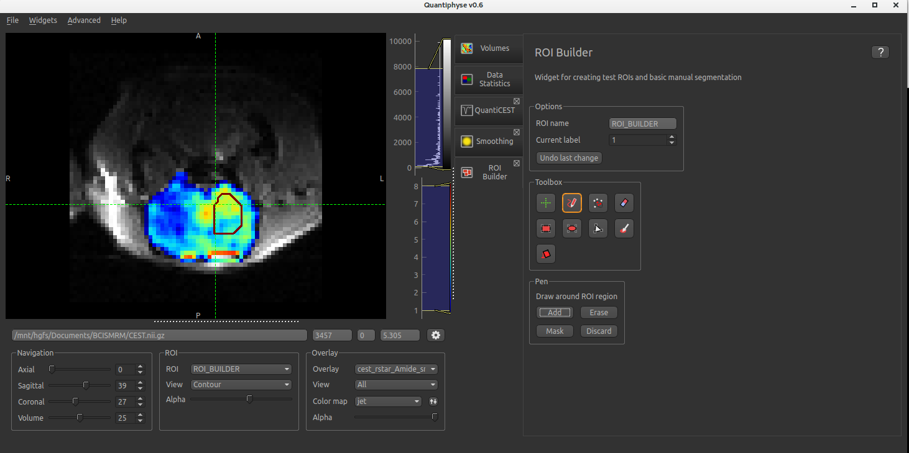
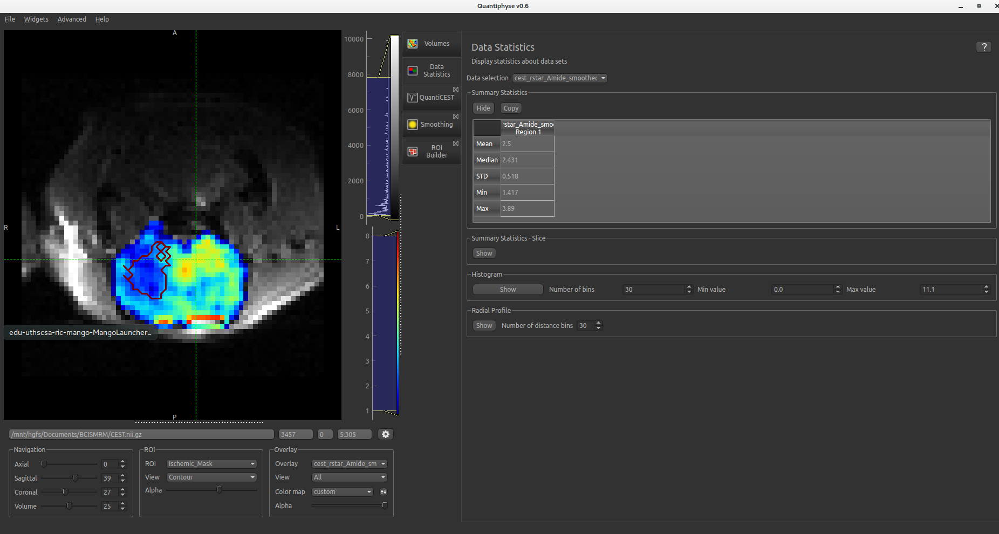
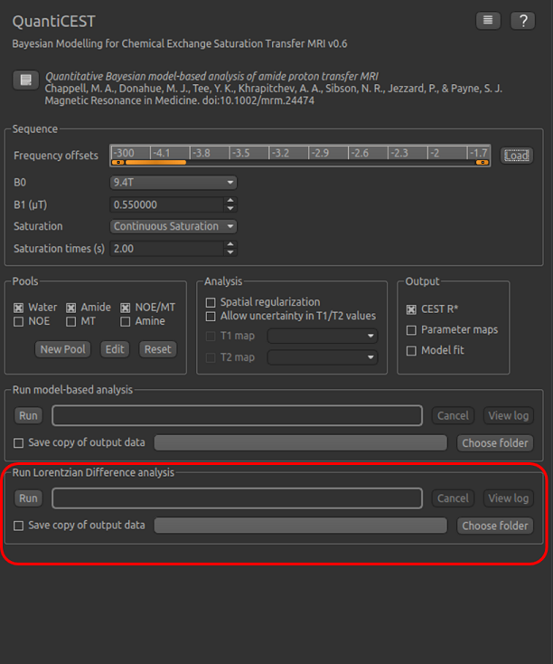
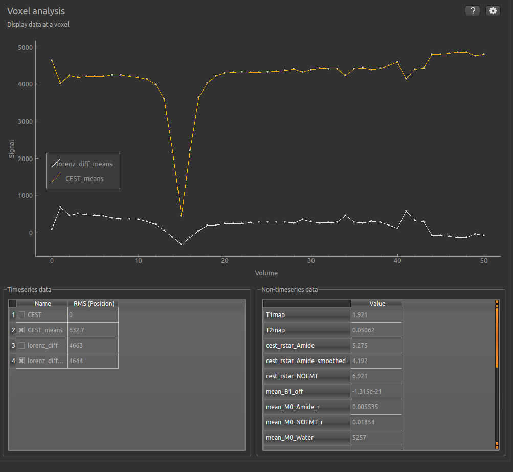

QuantiCEST Tutorial
===================

Introduction
------------

This example aims to provide an overview of Bayesian model-based analysis for CEST [1]_ using the QuantiCEST widget [2]_
available as part of Quantiphyse [3]_. Here, we work with a preclinical ischaemic stroke dataset using continuous 
wave CEST [4]_, however the following analysis pipeline should be applicable to both pulsed and continuous wave 
sequences acquired over a full Z-spectrum.  

Loading Data
------------

A link to the data used in this tutorial is given below. The data and additional processing files are provided in
a self-extracting encrypted ZIP file - the password will be provided at the tutorial.

Files can be loaded in NIFTI or DICOM format either by dragging and dropping in to the view pane, or by clicking 
``File`` -> ``Load Data`` and navigate to the appropriate file. Confirm that the file is ``Data`` rather than 
``ROI`` and proceed. 

.. note::
    If your single slice CEST NIFTI file is in 3D format rather than 4D, you may need to select ``Advanced Options``
    when loading data and ``Treat as 2D multi-volume``. 

Double clicking on the viewing-pane will allow you to switch between axial/coronal/sagittal views. 

Pre-processing
--------------

Brain Extraction
~~~~~~~~~~~~~~~~

For clinical data, we recommend brain extraction is performed as a preliminary step using FSL’s BET tool [5]_, with the 
``–m`` option set to create a binary mask. It is recommended to include a brain ROI as this will decrease processing 
time considerably. 

The preclinical brain masks have been made in advance; load via the ``File`` menu, and as ``ROI`` datatype. Once loaded, 
it will show up in the ``ROI`` dropdown under the viewing pane. 

Motion Correction
~~~~~~~~~~~~~~~~~

Motion correction can be implemented using FSL's MCFLIRT tool within Quantiphyse (or beforehand using FSL). To run 
within Quantiphyse, select ``Widgets`` ->  ``Processing`` -> ``Registration``. After setting the mode to 
``Motion Correction``, default settings will be loaded to match those in FSL. For CEST data, you probably want 
to set the reference volume to an unsaturated image, so we have set the ``Reference Volume`` to a ``Specified volume``
of 0. 

Visualising Data
----------------

Raw data can be interrogated interactively by selecting ``Widgets`` -> ``Analysis`` -> ``Multi-Voxel Analysis``.  
Data will be plotted for selected voxels across frequency offsets, and the typical Z-spectra shape should be 
visible for voxels within the brain. 
  

Bayesian Model-based Analysis 
-----------------------------

The QuantiCEST tool is under ``Widgets`` -> ``CEST`` -> ``QuantiCEST``. Default options are available for 3T 
clinical and 9.4T preclinical studies, however these will likely need adjusting for your specific setup 
(in this instance the sequence parameters do not need altering).

Firstly, the frequency offsets should match your acquisition and so the length should match the number of volumes 
in your CEST data. You can enter these manually, or via the Load button. It is most practical to have these stored 
in a .txt or .mat file, with one offset per row. 

In general, a minimum of three pools should be included in model-based analysis. We provide some of the most common 
pools to include, along with literature values for frequency offset, exchange rate, and T1 and T2 values for the 
field strengths of 3T and 9.4T. Pool characteristics can be fully edited, and additional pools added via the ``Edit``
and ``New Pool`` options. 

It is advisable to select the ``Allow uncertainty in T1/T2 values``, regardless of whether separate T1 and T2 maps 
are acquired.  In this case, maps were acquired with this dataset, and so load ``T1map.nii`` and ``T2map.nii`` 
via the ``File`` menu, and select from the dropdown. 

The specific pools to be included in the model can be altered either by checking more/less boxes under the ``Pools`` 
tab where literature values will be loaded, or edited manually by selecting the ``New Pool`` option. 

By default, CESTR* maps will be output, with the added option to output individual parameter maps, as well as fitted 
curves. It is wise to set both of these options, so that fitted data can be properly interrogated. To save outputs, 
select ``Save copy of output data`` and choose a relevant folder. 

.. note::
    Analysis will attempt to run on whatever data and ROI is currently loaded in to the viewing pain (you can change
    this by clicking on the ``Overlay`` and ``ROI`` dropdowns).  You will want to have either raw or motion-corrected CEST
    loaded along with a brain mask ROI.
  
Visualising Processed Data
--------------------------

Both the raw and fitted data can be viewed on a voxelwise basis under ``Widget`` -> ``Analysis`` -> ``Voxel analysis``. 
For each non-water pool included in the model there will be a corresponding CESTR* map output (here amide and a 
macromolecular pool), and these values will be summarised for each voxel underneath the timeseries data.

Here we are most interested in the behaviour of the Amide pool; cest_rstar_Amide. In this preclinical example, 
there is an ischemic region on the right hand side of the brain. On visual inspection, it looks to result in 
reduced CESTR*, however regions of interest (ROI) can be loaded to extract quantitative metrics. 

You may also want to apply some smoothing to the data, which can be accessed via the Processing Widget. Select 
cest_rstar_Amide to smooth, and define the smoothing kernel size (shown below for  sigma = 0.4 mm)

Extracting quantitative Metrics
-------------------------------

An ROI can either be loaded via the File menu or drawn manually using the ROI Builder (``Widget`` -> ``ROIs`` -> 
``ROI Builder``). 

When using the ROI builder, both the ROI name and value can be set (useful for defining multiple regions within a 
single image file), and manually defined using one of the supplied drawing tools (pen, predefined shape or automated 
segmentation). ROIs created in ROI Builder can be saved via the File menu. 

To explore the data further, load an ROI for the ischemic portion, Ischemic_mask.nii, via the File menu, and then 
manually draw a contralateral ROI

The ``Data Statistics`` panel will summarise the selected data for whichever ROI is currently selected. Here you can 
see the ischemic ROI displayed and summarised. As expected, CESTR* of the amide pool is lower for the ischemic
tissue than for healthy tissue. 

Beyond CESTR*
-------------

The minimum outputs from running model-based analysis are the model-fitted z-spectra, and CESTR* maps for non-water 
pools, as defined in your model setup. If the Parameter Maps option is highlighted then for each pool, including 
water, there will be additional maps of proton concentration and exchange rate (from which CESTR* is calculated), as 
well as frequency offset (ppm). For water, the offset map represents the correction for any field inhomogeneities. 

If the ``Allow uncertainty in T1/T2 values`` is set then fitted maps of T1 and T2 will be available for each pool. 
Naming conventions follow the order the pools are defined in the QuantiCEST setup panel. 

Viewing data without the water baseline
---------------------------------------

Rather than doing a full model-based analysis as described in section Bayesian model-based analysis, QuantiCEST also 
has the option simply remove the water baseline from the raw data, allowing you to directly view or quantify the 
smaller non-water peaks in the acquired CEST volume. Baseline removal is done using the Lorentzian Difference
Analysis (LDA) option in QuantiCEST, highlighted by the red rectangle below.

LDA works by fitting a subset of the raw CEST data (within ±1ppm, and beyond ±30ppm) to a water pool (or a water 
plus MT pool if chosen), and then subtracting this model fit from the data. This leaves behind the smaller non-water 
peaks in the data, called a Lorentzian Difference spectrum. QuantiCEST outputs this as ``lorenz_diff.nii.gz``.

Data is loaded as previously described, and by default QuantiCEST defines the baseline as a water pool. An example 
output of the data with the baseline removed is shown.

Running QuantiCEST from the command line
----------------------------------------

Here we have covered basic model-based analysis of CEST data using the interactive GUI. For some, it may be more desirable to automate this analysis so that it can be run from the command line. While beyond the scope of this tutorial, it can be set up relatively simply, with batch processing options for your given analysis provided within the QuantiCEST widget via the following icon |batchbutton|. More details can be found on the quantiphyse website. 

References: 

.. [1] Chappell et al., Quantitative Bayesian model‐based analysis of amide proton transfer MRI, Magnetic Resonance in Medicine, 70(2), (2013).
.. [2] Croal et al., QuantiCEST: Bayesian model-based analysis of CEST MRI. 27th Annual Meeting of International Society for Magnetic Resonance in Medicine, #2851 (2018).
.. [3] www.quantiphyse.org
.. [4] Ray et al., Investigation into the origin of the APT MRI signal in ischemic stroke. Proc. Int. Soc. Magn. Reson. Med. 25 (2017).
.. [5] S.M. Smith. Fast robust automated brain extraction. Human Brain Mapping, 17(3):143-155, 2002.

