QuantiCEST Tutorial
===================

Introduction
------------

This example aims to provide an overview of Bayesian model-based analysis for CEST [1]_ using the QuantiCEST widget [2]_
available as part of Quantiphyse [3]_. Here, we work with a preclinical ischaemic stroke dataset using continuous 
wave CEST [4]_, however the following analysis pipeline should be applicable to both pulsed and continuous wave 
sequences acquired over a full Z-spectrum.  

Basic Orientation
-----------------

This is a quick orientation guide to Quantiphyse if you've not used it before. Start the
program by typing ``quantiphyse`` at a command prompt, or clicking on the Quantiphyse
icon |qp| in the menu or dock.

.. |qp| image:: screenshots/qp_logo.png 
    :scale: 40%

.. image:: screenshots/main_window_basic.png

Image view
~~~~~~~~~~

The left part of the window contains three orthogonal views of your data. We will describe
how to load data in the main tutorial.

 - Left mouse click to select a point of focus using the crosshairs
 - Left mouse click and drag to pan the view
 - Right mouse click and drag to zoom
 - Mouse wheel to move through the slices
 - Double click to 'maximise' a view, or to return to the triple view from the maximised view.

View and navigation controls
~~~~~~~~~~~~~~~~~~~~~~~~~~~~

Just below the viewer these controls allow you to move the point of focus and also change 
the view parameters for the current ROI and overlay.

Widgets
~~~~~~~

The right hand side of the window contains 'widgets' - tools for analysing and processing data.
Three are visible at startup:

 - ``Volumes`` provides an overview of the data sets you have loaded
 - ``Data statistics`` displays summary statistics for data set
 - ``Voxel analysis`` displays timeseries and overlay data at the point of focus

Select a widget by clicking on its tab, just to the left of the image viewer. 

More widgets can be found in the ``Widgets`` menu at the top of the window. The tutorial
will tell you when you need to open a new widget.

For a slightly more detailed introduction, see the :ref:`getting_started` section of the
User Guide.

Loading the CEST Data
---------------------

If you are taking part in an organized practical workshop, the data required will be available in your home
directory, in the ``fsl_course/CEST`` folder. If not, you should contact the authors as the data used is 
unpublished research data and cannot be made available for direct download.

.. image:: screenshots/drag_drop_choice.png
    :align: right

Files can be loaded in NIFTI or DICOM format either by dragging and dropping in to the view pane, or by clicking 
``File`` -> ``Load Data``. When loading a file you should indicate if it is data or an ROI by clicking the 
appropriate button when the load dialog appears. Load the following data file:

  - ``CEST.nii.gz``

The data should appear in the viewing window. In this case the data is a 2D slice so Quantiphyse has maximised the
relevant viewing window. If you double click on one of the views it returns to the standard of three orthogonal views
- this can be used with 3D data to look at just one of the slice windows at a time.

.. image:: screenshots/cest_tutorial_1.png

.. note::
    If your single slice CEST NIFTI file is in 3D format rather than 4D, you may need to select ``Advanced Options``
    when loading data and ``Treat as 2D multi-volume``. 

Pre-processing
--------------

Brain Extraction
~~~~~~~~~~~~~~~~

For clinical data, we recommend brain extraction is performed as a preliminary step using FSL’s BET tool [5]_, with the 
``–m`` option set to create a binary mask. You can also do this from within Quantiphyse using the FSL integration
plugin. It is strongly recommended to include a brain ROI as this will decrease processing time considerably. 

In this case we have preclinical data for which BET is not optimised, so we have prepared the brain mask in advance 
in the following file:

  - ``Brain_mask.nii.gz``

Load this data set via the ``File`` menu, and his time select ``ROI`` as the data type. Once loaded, it will show up in the ``ROI`` 
dropdown under the viewing pane, and will also be visible as a red shaded region on the CEST data:

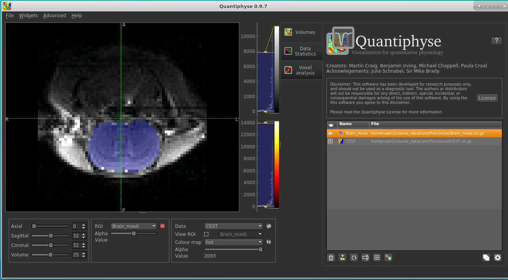

When viewing the output of modelling, it may be clearer if the ROI is displayed as an outline rather than a shaded
region. To do this, select ``Contour`` from the ``View`` options below the ROI selector:

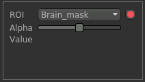

.. note::
    If you accidentally load an ROI data set as ``Data``, you can set it to be an ROI using the ``Volumes`` widget
    (visible by default). Just click on the data set in the list and click the ``Toggle ROI`` button.

Motion Correction
~~~~~~~~~~~~~~~~~

.. note::
    If you prefer you can skip this step - motion correction does not improve this data significantly.

Motion correction can be implemented using FSL's MCFLIRT tool within Quantiphyse, or beforehand using FSL. To run 
within Quantiphyse, select ``Widgets`` ->  ``Registration`` -> ``Registration``. 

To run motion correction on the data, you need to:

  - Set the registration mode to ``Motion Correction``
  - Ensure the method is set to ``FLIRT/MCFLIRT``
  - Select ``CEST`` as the ``Moving data``
  - Select the reference volume as ``Specified volume``. 
  - For CEST data, you probably want the motion correction reference to be an unsaturated image, so we have set
    ``Index of reference volume`` to 0 to select the first image in the CEST sequence.
  - Set the output name to ``CEST_moco``

The resulting setup should look like this:

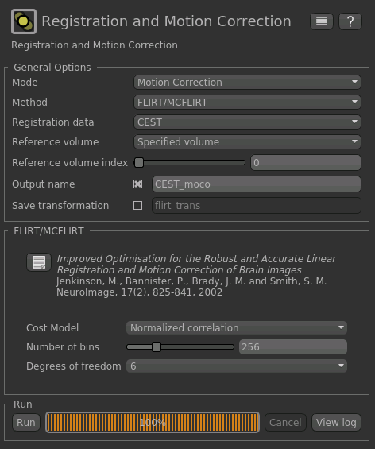

Click ``Run`` to run the motion correction. The output in this case is not much different to the input as there
was not much motion in this data, however if you switch between ``CEST`` and ``CEST_moco`` in the ``Overlay``
selector (below the image view) you may be able to see slight differences.

Visualising Data
----------------

Select the ``Voxel Analysis`` widget which is visible by default to the right of the viewing window. By
clicking on different voxels in the image the Z-spectra can be displayed:
  
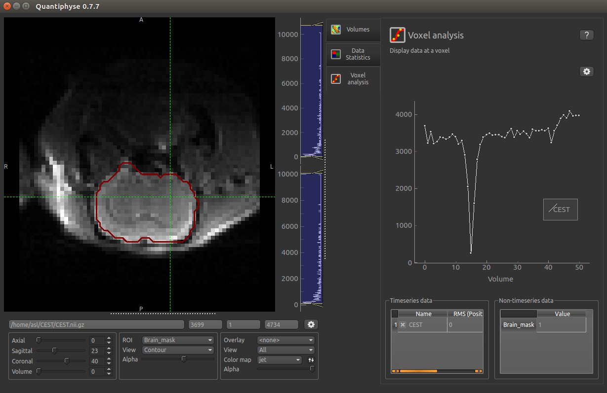

Bayesian Model-based Analysis 
-----------------------------

To do CEST model analysis, select the QuantiCEST tool from the menu: ``Widgets -> CEST -> QuantiCEST``. The widget 
should look something like this:

.. image:: screenshots/cest_tutorial_widget.png

Data and sequence section
~~~~~~~~~~~~~~~~~~~~~~~~~

To begin with, make sure the ``CEST`` data set is selected as the CEST data, and the ``Brain_mask``
ROI is selected as the ROI.

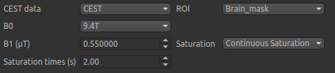

The B0 field strength can be selected as 3T for clinical and 9.4T for preclinical studies. This selection
varies the pool defaults. If you choose ``Custom`` as the field strength as well as specifying 
the value you will need to adjust the pool defaults (see below).

In this case the acquisition parameters do not need altering, however in general you will need to 
specify the B1 field strength, saturation method and saturation time for your specific setup.

Next we will specify the frequency offsets of your acquisition - this is a set of frequences whose length
must match the number of volumes in the CEST data. You can enter them manually, or if they are stored in
a text file (e.g. with one value per row) you can click the ``Load`` button and choose the file. 

For this tutorial we have provided the frequency offsets in the
file ``Frequency_offsets.txt``, so click ``Load``, select this file and verify that the values are as follows:

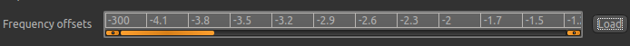

Pool specification
~~~~~~~~~~~~~~~~~~

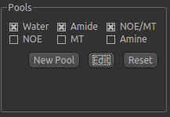

In general, a minimum of three pools should be included in model-based analysis. We provide some of the most common 
pools to include, along with literature values for frequency offset, exchange rate, and T1 and T2 values for the 
field strengths of 3T and 9.4T. The data for the pools we have selected can be displayed by clicking the ``Edit``
button:

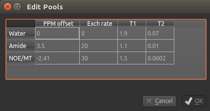

You can also use this dialog box to change the values, for example if you are using a custom field strength. The
``Add`` button can also be used if you want to use a pool that isn't one of the ones provided.

Analysis section
~~~~~~~~~~~~~~~~

In the analysis section we have the option of allowing the T1/T2 values to vary. We will enable this, but provide
T1 and T2 maps to guide the modelling. These maps are stored in the following files:

  - ``T1map.nii``
  - ``T2map.nii``

Load both of these files into Quantiphyse using ``File->Load Data`` as before. Now select the ``T1 map`` and ``T2 map``
checkboxes, and select the appropriate data sets from the dropdown menus. The result should look like this:

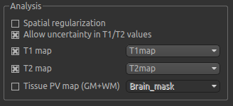

Output section
~~~~~~~~~~~~~~

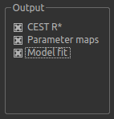

By default, CESTR* maps will be output, with the added option to output individual parameter maps, as well as fitted 
curves. As shown above, we have set both of these options, so that fitted data can be properly interrogated. 

Running model-based analysis
~~~~~~~~~~~~~~~~~~~~~~~~~~~~

The ``Run`` button is used to start the analysis. The output data will be loaded into Quantiphyse but if you would
also like to save it in a file, you can select the ``Save copy of output data`` checkbox and choose a folder
to save it in.

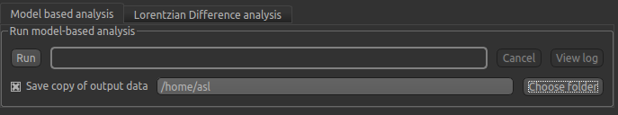
  
Visualising Processed Data
--------------------------

If you re-select the ``Voxel analysis`` widget which we used at the start to look at the CEST signal in the 
input data, you can see the model prediction overlaid onto the data. By clicking on different voxels you
can get an idea of how well the model has fitted your data.

.. image:: screenshots/cest_tutorial_modelfit.png

For each non-water pool included in the model there will be a corresponding CESTR* map output (here amide and a 
macromolecular pool), and these values will be summarised for each voxel underneath the timeseries data.

.. image:: screenshots/cest_tutorial_params.png

Here we are most interested in the behaviour of the Amide pool; cest_rstar_Amide. In this preclinical example, 
there is an ischemic region on the right hand side of the brain. If we select ``cest_rstar_Amide`` from the
overlay selector (below the viewing window), a reduced CESTR* is just about visible.

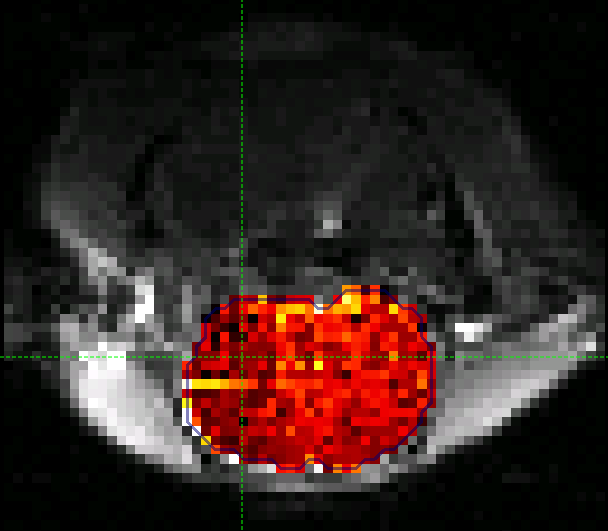

We can extract quantitative metrics for this using regions of interest (ROIs). Before doing this it can 
help to apply some smoothing to the data. From the menu select ``Widgets->Processing->Smoothing`` and set
the options to smooth ``cest_rstar_Amide`` with a smoothing kernel size of 0.4mm:

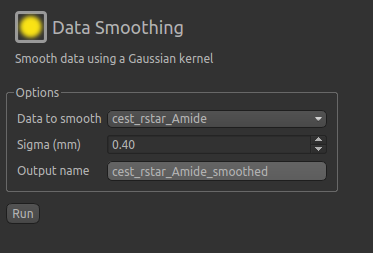

The output of this smoothing appears as follows:

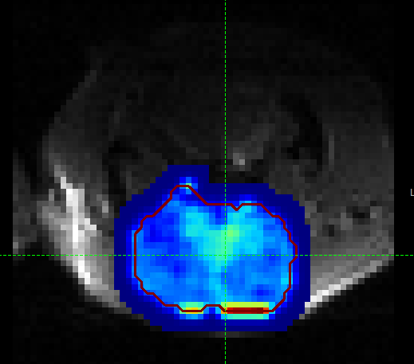

The ischaemic region is a little more visible in this section (to the left of the image, i.e. the
right side of the brain).

Extracting quantitative Metrics
-------------------------------

We have prepared an ROI for the ischaemic region in the file:

  - ``Ischemic_mask.nii``

Load this file using ``File->Load Data``, selecting it as an ROI.

Now open the ``Data Statistics`` widget which is visible by default above the ``Voxel Analysis`` widget. We 
can now select statistics on ``cest_rstar_Amide`` within this ROI (click on ``Summary statistics`` to view):

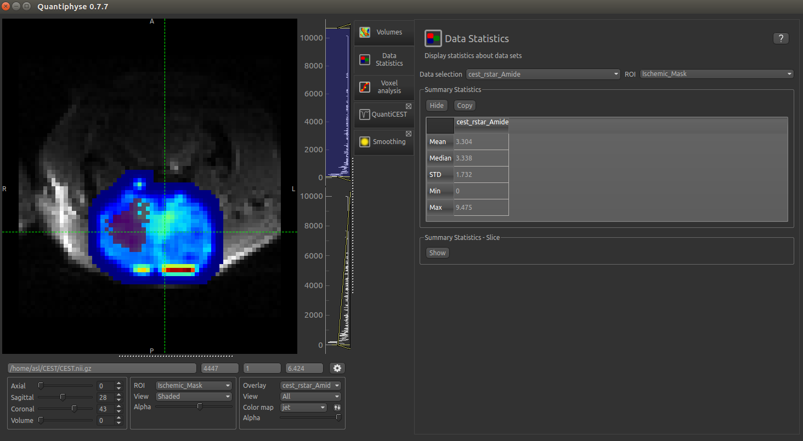

Note that it is possible to display statistics from more than one data set, however here we are just going
to look at the CESTR* for the Amide pool.

To compare with the non-ischemic portion, we will now draw a contralateral ROI. To do this, open the
``Widgets->ROIs->ROI Builder`` and select the ``Ischemic_mask`` ROI for editing:

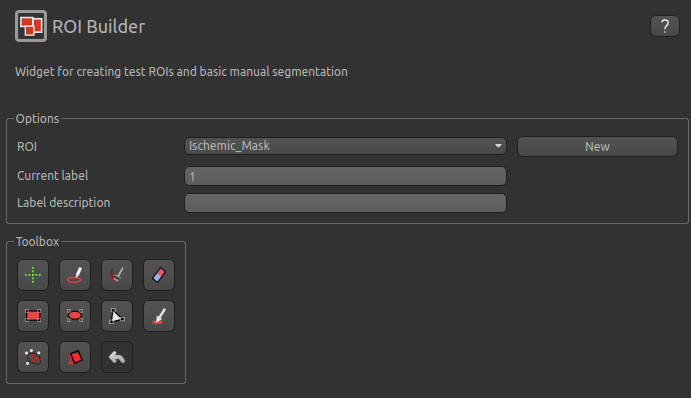

The default label of 1 has been used to label the ischemic core, so type ``ischemic`` in the  ``Label description`` box.
Now enter a new label number (e.g. 2) and change the default name from ``Region 2`` to ``contralateral``:

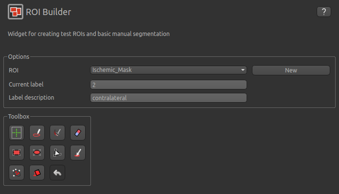

To manually draw a contralateral ROI, use either the pen tool |pen| to draw freehand around a region on the opposite
side of the brain, or use one of the other tools to select a suitable region - for example you could draw it 
as an ellipse using the |ellipse| tool. After drawing a region, click ``Add`` to add it to the ROI. It should appear 
in a different colour as it is a different label. Here is an example (the new contralateral region is yellow):

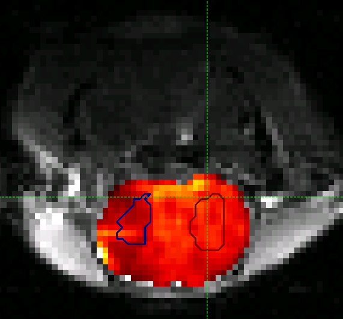

Now go back to the ``Data Statistics`` widget where we can compare the CESTR* in the two regions we have defined.
As expected, CESTR* of the amide pool is lower for the ischemic tissue than for healthy tissue. 

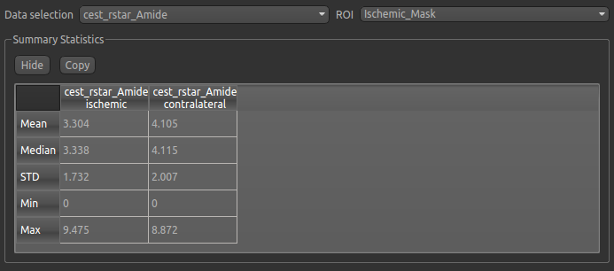

.. |ellipse| image:: screenshots/roi_tools_ellipse.png 

.. |pen| image:: screenshots/roi_tools_pen.png 

Beyond CESTR*
-------------

The minimum outputs from running model-based analysis are the model-fitted z-spectra, and CESTR* maps for non-water 
pools, as defined in your model setup. If the Parameter Maps option is highlighted then for each pool, including 
water, there will be additional maps of proton concentration and exchange rate (from which CESTR* is calculated), as 
well as frequency offset (ppm). For water, the offset map represents the correction for any field inhomogeneities. 

If the ``Allow uncertainty in T1/T2 values`` is set then fitted maps of T1 and T2 will be available for each pool. 
Naming conventions follow the order the pools are defined in the QuantiCEST setup panel. 

Viewing data without the water baseline
---------------------------------------

Rather than doing a full model-based analysis as described in section Bayesian model-based analysis, QuantiCEST also 
has the option simply remove the water baseline from the raw data, allowing you to directly view or quantify the 
smaller non-water peaks in the acquired CEST volume. Baseline removal is done using the Lorentzian Difference
Analysis (LDA) option in QuantiCEST - this is available by selecting the alternative tab in the box containing
the ``Run`` button.

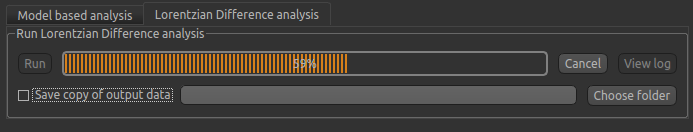

LDA works by fitting a subset of the raw CEST data (within ±1ppm, and beyond ±30ppm) to a water pool (or a water 
plus MT pool if chosen), and then subtracting this model fit from the data. This leaves behind the smaller non-water 
peaks in the data, called a Lorentzian Difference spectrum. QuantiCEST outputs this as ``lorenz_diff.nii.gz``.
This can be viewed in the ``Voxel Analysis`` widget alongside the data signal and the model-based fit:

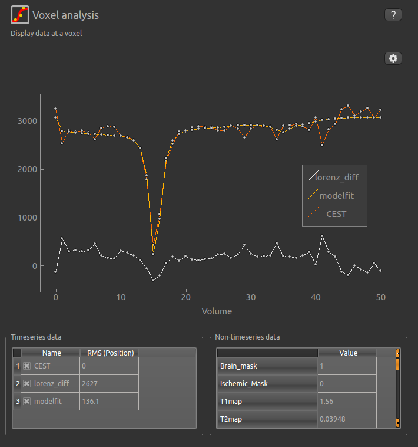

Running QuantiCEST from the command line
----------------------------------------

Here we have covered basic model-based analysis of CEST data using the interactive GUI. If you have multiple data sets
it may be desirable to automate this analysis so that the same processing steps can be run on several data sets from
the command line, without interactive use.

Although this is beyond the scope of this tutorial, it can be set up relatively simply. The batch processing options
for the analysis you have set up can be displayed by clicing on the following button at the top of the QuantiCEST 
widget |batchbutton|. For more information see documentation for :ref:`batch`.

.. |batchbutton| image:: screenshots/batch_button.png 

References
----------

.. [1] Chappell et al., Quantitative Bayesian model‐based analysis of amide proton transfer MRI, Magnetic Resonance in Medicine, 70(2), (2013).
.. [2] Croal et al., QuantiCEST: Bayesian model-based analysis of CEST MRI. 27th Annual Meeting of International Society for Magnetic Resonance in Medicine, #2851 (2018).
.. [3] www.quantiphyse.org
.. [4] Ray et al., Investigation into the origin of the APT MRI signal in ischemic stroke. Proc. Int. Soc. Magn. Reson. Med. 25 (2017).
.. [5] S.M. Smith. Fast robust automated brain extraction. Human Brain Mapping, 17(3):143-155, 2002.

