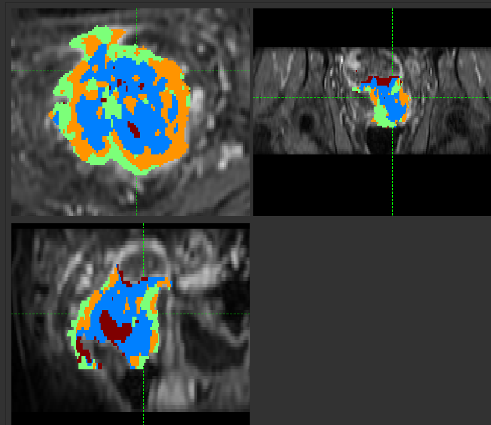
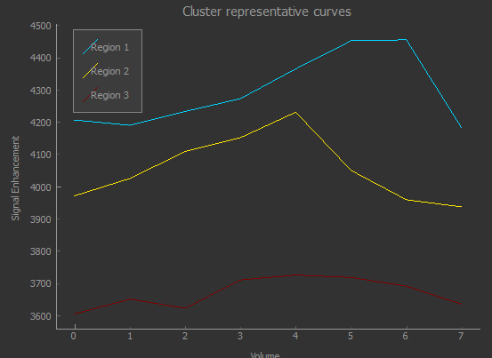
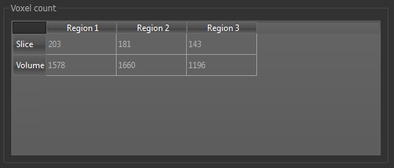
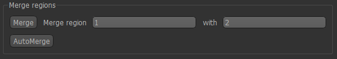

K-Means Clustering
================

*Widgets -> Clustering -> KMeans Clustering*

Clustering uses the K-Means algorithm to cluster 3D or 4D data into discrete regions.

When used with 4D data, PCA reduction is used to convert the volume sequence into 3D data before K-Means
is applied. 

Options
-------

- Data set to use for clustering (defaults to current overlay)
- ROI to cluster within (optional, but recommended for most data)
- Name of the output ROI data set
- Number of clusters, i.e. how many subregions the ROI will be split into
- For 4D data, the number of PCA modes to use for reduction to 3D.

On clicking ``Run``, a new ROI is produced with each cluster assigned to an integer ID. 

Show representative curves
--------------------------

This option is available when clustering 4D data, and displays the mean time-series curves for 
each cluster.

In this case the clusters correspond to two distinct phase offsets of the signal curve, with a third cluster picking up voxels with weak or no signal.

Show voxel counts
-----------------

This option shows the number of voxels in each cluster, overall and within the current slice.

Show merge options
------------------

Having generated clusters, it may be desirable to merge some of the subregions - for example if two are
very similar, or one contains very few voxels. The ``Merge`` tool allows you to do this by specifying the
two regions to be merged.

An ``Auto Merge`` tool is also provided to automatically identify subregions for merging.

