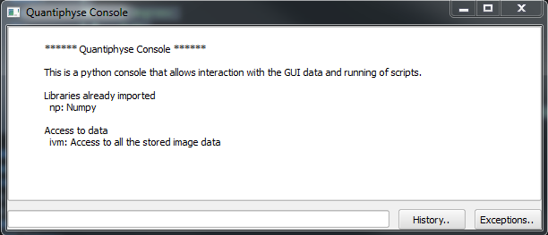
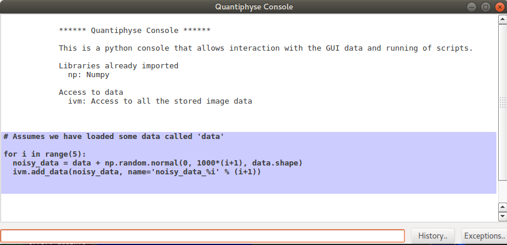
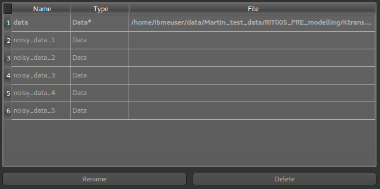

Using the console
=================

The console is an advanced tool which allows you to interact directly with the data structures within 
the program. You might use this to perform processing steps which don't have a predefined widget, using
the full power of Python and the Numpy and Scipy libraries.

To open the console, select ``Console`` from the ``Advanced`` menu.

Objects provided
----------------

The main predefined variables are:

  - ``ivm`` - The volume management object. It provides the ``add_data`` and ``add_roi`` methods you need
    to get data into the viewer

  - Each existing data item is a named variable - for example if you have an overlay named ``T10`` there will
    be a variable ``T10`` which contains the data.

The following namespaces are predefined:

 - ``np`` - The Numpy module

Working with data
-----------------

Data objects are subclasses of Numpy arrays and can support any operations on them. To add new data into 
the viewer you use the ``add_data()`` or ``add_roi()`` methods.

Examples
--------

 - Create a series of data objects by adding varying levels of Gaussian noise to an existing data set

This creates 5 new data sets containing the original test_data plus random Gaussian noise with mean 0 
and standard deviations between 1000 and 5000.

