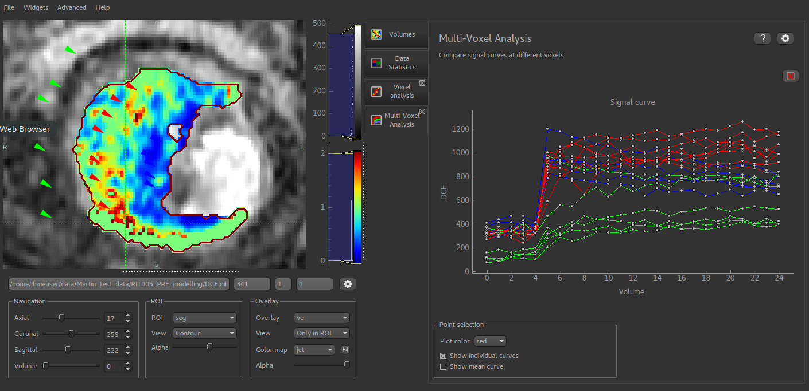
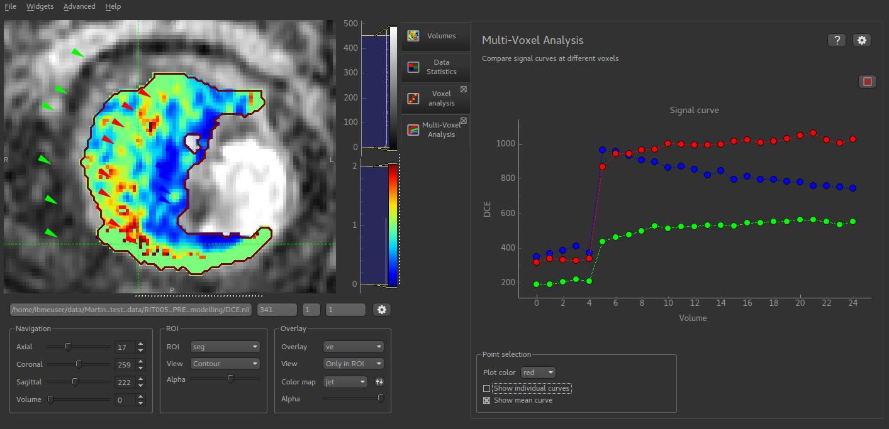

Multi-voxel analysis
====================

*Widgets -> Analysis -> Multi-voxel Analysis*

This widget shows the signal-time curve at multiple locations.

- Each click on the image adds a new curve to the plot. By changing
  the colour, a series of curves can be plotted enabling different parts of the image to be compared

- The plot can be cleared by clicking on the red X at the top right of the window

- The mean curve for each color can also be displayed. This is shown with large circular markers and 
  a dotted line. This can be displayed with the individual curves, or on its own (as below)

Additional plot options are available by clicking the Options button in the top right.
