ASL data tab
------------

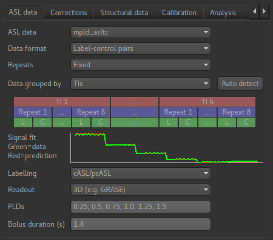

This tab describes the structure and acquisition parameters of your ASL data. Once you define the 
structure of a data set in one ASL widget, others will automatically pick up the same structure when 
using that data set. In addition, if you save the data set to a Nifti file, the structure information is
saved as optional metadata and will be recognised when you load the data back into Quantiphyse.

Start by choosing the ASL data
set you want to analyse from the ``ASL data`` selection box (it must be loaded into Quantiphyse first).

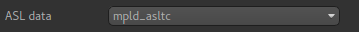

Data format
###########

The data format describes the labelling scheme used for the data and can be described as 
 - Label-control pairs
 - Control-Label pairs
 - Multiphase
 - Vessel encoded
 - already tag-control subtracted or multiphase
 
Note that currently multiphase data is not supported by this widget, however a multiphase
preprocessing widget is provided.

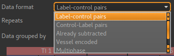

Repeats
#######

By default repeats are fixed. The ASL widget will figure out how many repeats you have.

.. image:: screenshots/asl_data_repeats.png

You can also select variable repeats, in which case each TI/PLD may have a different number of
repeats.

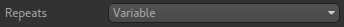

The repeats entry is at the bottom with the TIs/PLDs and bolus duration. This is because there
needs to be the same number of each so it's sensible to keep them together.

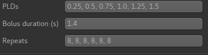

Data grouping/order
###################

This describes the sequence of volumes contained in the ASL data set, and what each volume contains. 
The two main choices are ``Grouped by TIs`` and ``Grouped by repeats``.

When grouped by TIs, the sequence of volumes would be as follows::

  1. Tag for first TI
  2. Control for first TI
  3. Rrepeat tag for first TI
  4. Repeat Control for first TI
     ... as above for remaining repeats
  11. Tag for second TI
  12. Control for second TI
  13. Repeat tag for second TI
  14. Repeat Control for second TI
     ... etc

Data structure visualisation
~~~~~~~~~~~~~~~~~~~~~~~~~~~~

The data structure visualisation shows how the data is grouped inside the file (the volumes in
the data increase from left to right).

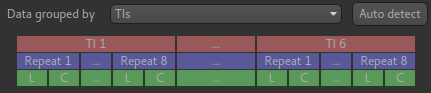

Starting at the top, this shows that the volumes are divided up into blocks corresponding to
the 6 TIs we have defined. Within each block we have 8 repeats of this TI, and each repeat
consists of a label and control image (in that order).

Signal fit visualisation
~~~~~~~~~~~~~~~~~~~~~~~~

In addition the ``Signal Fit`` visualisation compares the mean signal from your data with 
what would be expected for the data grouping you have chosen. In this case they match 
closely, which is a good check that we have chosen the correct grouping option.

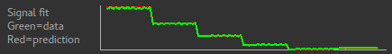

When grouped by repeats, the volume sequence would be as follows::

  1. Tag for first TI
  2. Control for first TI
  3. Tag for second TI
  4. Control for second TI
     ... as above for remaining TIs
  11. Repeat of Tag for first TI
  12. Repeat of Control for first TI
  11. Repeat of Tag for second TI
  12. Repeat of Control for second TI
      ... etc

And the data structure visualisation looks like this:

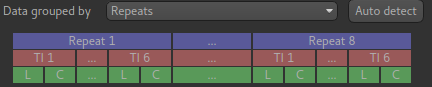

Signal fit visualisation - bad fit
~~~~~~~~~~~~~~~~~~~~~~~~~~~~~~~~~~

In this case the correct grouping order was by TIs, as we saw above. If we select repeats
the signal fit will show us that the data do not
match what we would expect - this means we have got our grouping option wrong!

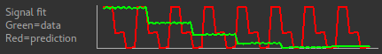

Autodetecting the grouping order
~~~~~~~~~~~~~~~~~~~~~~~~~~~~~~~~

The ``Auto detect`` button tries to guess (based on the closeness of the signal fit) what the
best grouping option is for our data. In most cases it will guess correctly, however care should
be taken if your data does not fit into one of the standard patterns (see ``Custom ordering`` below)

Advanced: custom ordering
~~~~~~~~~~~~~~~~~~~~~~~~~

Occasionally, you may encounter ASL data with a different structure. For example if might start 
with tag images for all TIs and repeats, and then have control images for all TIs and repeats
afterwards. In this case you should select ``Custom`` as the grouping order and enter a string 
of two or three characters in the text box to define your ordering. The characters should be chosen
from:

 - ``l`` for variation in the label (i.e. tag/control or vessel encoding cycles)
 - ``t`` for variation in the TIs/PLDs
 - ``r`` for variation in the repeat number

 The characters should be ordered so the first is the *fastest* varying and the last is the slowest
 varying. For example the two standard 'Grouped by TIs' and 'Grouped by repeats' options would be
 described by the ordering strings ``lrt`` and ``ltr``. If all the tag images are together and
 all the control images follow, and within each block the data is grouped by repeats the ordering
 string would be ``trl``.
 
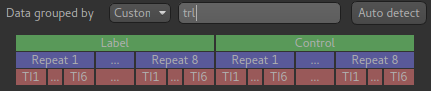

Labelling
#########

The labelling method is either cASL/pcASL or pASL. In cASL/pcASL, the effective TI for each volume is 
determined by adding the post-labelling delay (PLD) to the bolus duration. In pASL, the TIs are 
specified directly.

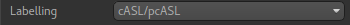

Readout
#######

Data acquired with a 3D readout requires no special processing, however if the readout was 2D then
each slice will be at a slightly different TI/PLD (the volume TI/PLD in this case is the *initial*
TI/PLD).

Selecting 2D readout enables additional options for setting the the delay time per slice so suitable
adjustments in the TI/PLD can be made for each slice. It is also possible to specify a multiband readout.

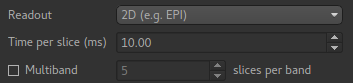

TIs/PLDs
########

The TIs or PLDs recorded in the ASL data must be specified, with the corresponding bolus durations. 
Initially data is interpreted as single-TI, however additional TIs can be added by typing their values
into the entry box. Values can be separated by commas or whitespace.

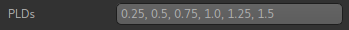

If the number of PLDs specified is not consistent with the number of data volumes, a warning is 
displayed. Here we have removed a PLD so there are only 5 which does not match the data which 
has 96 volumes.

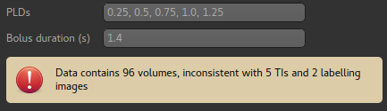

Here we have specified a label-control dataset with 7 PLDs - this means the number of volumes should be
a multiple of 14.

Bolus duration(s)
#################

Most ASL sequences use a single bolus duration whose value should be entered in this box:

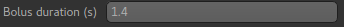

It is possible (but unusual) to use a different value for each TI/PLD. In this case a value can
be given for each TI/PLD:

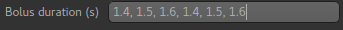

The number of values given must match the number of TIs/PLDs:

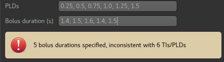