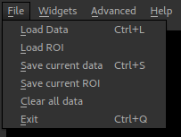
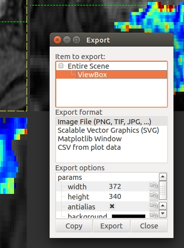
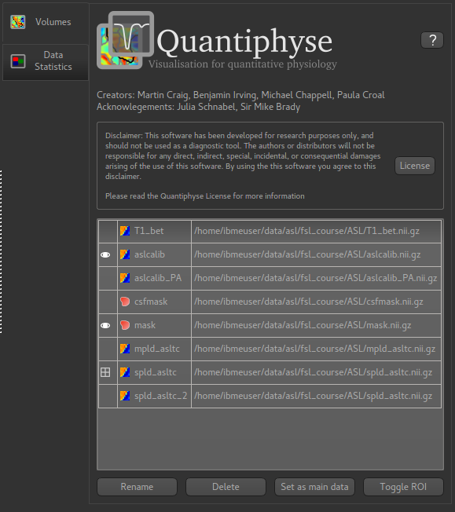
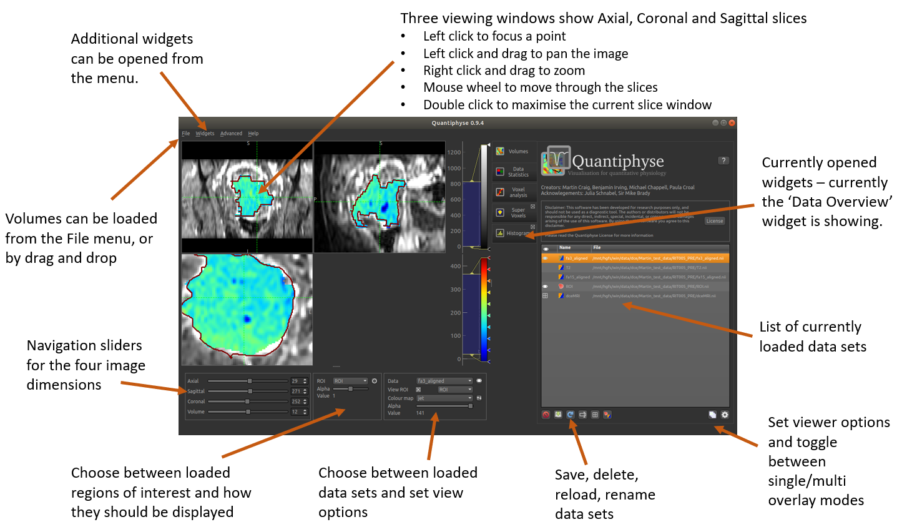
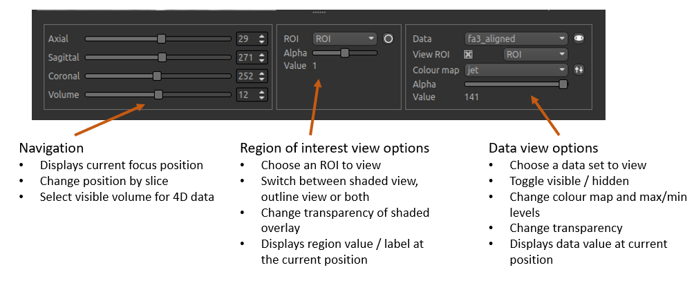
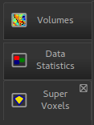
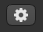
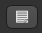
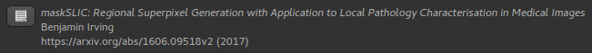

===============
Getting Started
===============

Loading and Saving Data
=======================

File Formats
------------

This software package works with NIFTI volumes. Some builds may contain experimental support for
folders of DICOM files, however this is not well tested.

Alternative packages which are able to convert DICOM files to NIFTI include the following: 

 - `itk-snap <http://www.itksnap.org/pmwiki/pmwiki.php>`_
 - `dcm2nii <https://www.nitrc.org/plugins/mwiki/index.php/dcm2nii:MainPage>`_
 - Or the batch version which allows a number of volumes to be converted 
   `dcm2niibatch <https://github.com/rordenlab/dcm2niix>`_

Loading data using Drag and Drop
--------------------------------

.. image:: screenshots/drag_drop_choice.png
    :align: right

You can drag and drop single or multiple files onto the main window to load data. You will be prompted to 
choose the type of data:
    
The suggested name is derived from the file name but is modified to ensure that it is a valid name
(data names must be valid Python variable names) and does not clash with any existing data.

If you choose a name which is the same as an existing data set, you will be asked if you wish to overwrite
the existing data. 

When dropping multiple files you will be asked to choose the type of each one. If you select *cancel* 
the data file will not be loaded.

Loading data using the menu
---------------------------

    
The ``File -> Load Data`` menu option can be used to load data files:

You will be prompted to choose the file type (data or ROI) and name in the same was as drag/drop.

Saving Data
-----------

The following menu options are used for saving data:

- File -> Save current data
- File -> Save current ROI

So, to save a data set you need to make it the current data, using the Overlay menu or the Volumes
widget. Similarly to save an ROI you need to make it the current ROI. Saving the main data can be 
done by selecting it as the current overlay.

Save a screen shot or plot
--------------------------

- Right click on an image or plot
- Click *Export*
- A view box will appear with the various format options. 
- *svg* format will allow editing of the layers and nodes in inkscape or another vector graphics viewer. 

The Volumes List
================

After loading data it will appear in a list on the ``Volumes`` widget, which is always visible
by default:

The icon on the left indicates whether the data is visible or not: |main_data| indicates that this
is the main data (and will appear as a greyscale background), |visible| indicates that this
data item is visible, either as an ROI or an overlay on top of the background. 

Currently one overlay and one ROI are visible at a time. This limitation was intended to support
the most common use case, but in the future the option to display multiple overlaid images will
be added.

The icon next to the data name shows whether it is an |roi_data| ROI or a |data| data set.

.. |roi_data| image:: screenshots/roi_data.png
.. |data| image:: screenshots/data.png

The Main Window
===============

The main window is quite busy, below is an overview of the main functions:

The Navigation Bar
==================

The navigation bar is below the main image viewer and allows the current viewing position, current
ROI and current data to be changed:

Using Widgets
=============

    
*Widgets* appear to the right of the viewer window. Most widgets are accessed from the 'Widgets' menu above the viewer. 

When selected, a widget will appear with a tab to the right of the viewer. You can switch between opened widgets by
clicking on the tabs. A widget opened from the menu can be closed by clicking on the X in the top right of its tab.

Widgets may have very different user interfaces depending on what they do, however there are a number of common elements:

|help| Help button
------------------

This opens the online documentation page relevant to the widget. Internet access is required.

|options| Options button
------------------------

This shows any extended options the widget may have. It is typically used by widgets which display plots as that limits the
space available for options.

|batch| Batch button
--------------------

.. |batch| image:: screenshots/batch_button.png

This displays the batch code required to perform the widget's processing, using the currently selected options. This can be useful
when building batch files from interactive exploration. It is only supported by widgets which provide image processing functions.

|cite| Citation
---------------

Many widgets are based around novel data processing techniques. The citation provides a reference to a published paper which can
be used to find out more information about the underlying method. If you publish work using a widget with a citation, you should
at the very least reference the paper given.

Clicking on the citation button performs an internet search for the paper.
