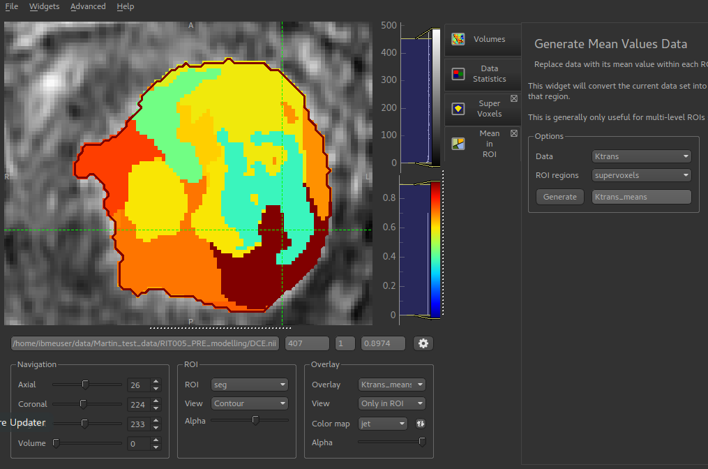

Mean value widget
=================

*Widgets -> ROIs -> Mean in ROI*

The mean values widget takes an overlay and an ROI and outputs a new overlay. Within each ROI
region, the new overlay contains the mean value of the original overlay within that region.

This is particularly useful with ROIs generated by clustering or supervoxel methods as it enables the generation
of a simplified version of the data where each supervoxel/cluster region has a single value.

The mean values widget also works with 4D data and will output the mean volume series for each ROI region.

*Example showing mean Ktrans value of each supervoxel*

