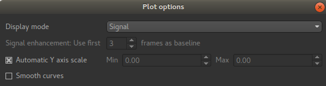

Voxel analysis
==============

- *Widgets -> Analysis -> Voxel Analysis*

This widget shows data at the selected voxel. This includes a plot of time-series data, and the point values
of 3D data sets. Selecting voxels in the viewer window updates the displayed data.

.. image:: screenshots/model_curves.png

Time series data is often generated by a modelling processes, for example the PK modelling 
widget, so this widget enables enable the model prediction to be compared to the original data. 

Below the plot a table shows all the 4D data sets loaded. The checkboxes control whether a given data
set is included in the plot or not.

A second table shows the value of each 3D data set at the focus point. This is useful after running
modelling as the model parameters can be viewed at the same time as comparing the overall quality of the
model fit.

The options button allows the behaviour of the plot to be changed:

You can choose to plot either the raw data or to transform the timeseries data to signal enhancement 
curves. This uses the selected number of volumes as 'baseline' and scales the remainder of the data
such that the mean value of the baseline volumes is 1.

