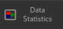
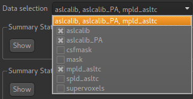
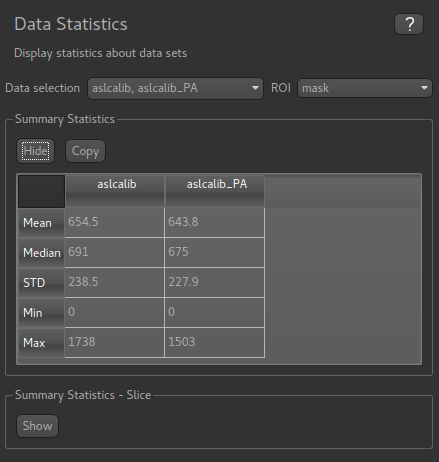
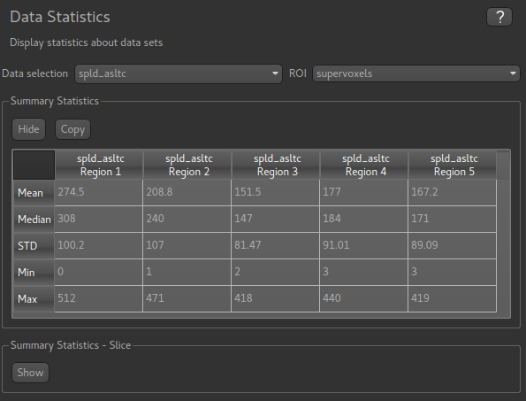
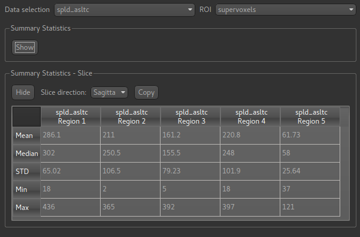

|icon| Data Statistics Widget
=============================

This widget displays summary statistics for selected data. The mean, median, standard deviation
and range are presented.

    
You can select any number of data items and an optional ROI from the menus at the top. Clicking
on the menu brings up a list of checkboxes to select the data items you want to include. Clicking
outside the menu closes the list.

If an ROI is selected then the summary statistics are presented separately for every region within 
that ROI:

In this example statistics for two data sets are presented within a single-region ROI:

The 'Copy' button for each table copies the data to the clipboard in a tab-separated form which should be
suitable for pasting into spreadsheets such as Excel.

In this example we display statistics for a single data set in each region of a multi-region ROI
(which was generated by the ``Supervoxels`` widget):

The ``Summary Statistics - Slice`` table can also be displayed - it presents essentially the 
same information but over the current slice shown in the viewer (either axial, coronal or sagittal):

