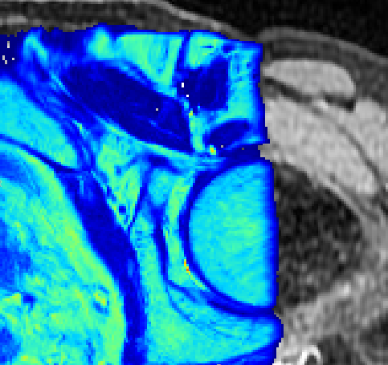
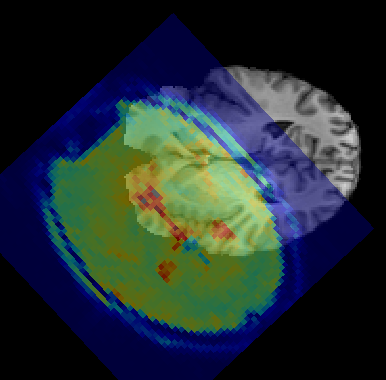

Overview
========

Quantiphyse is a visual tool for quantitative analysis of medical images. The aim is to bring
advanced analysis tools to users via an easy-to-use interface rather than focusing on the 
visualisation features themselves. 

The software is also designed to support advanced usage via
non-GUI batch processing and direct interaction with the Python code.

Quantiphyse works with two types of data:

 - 3D / 4D data sets. 
 
 - Regions of interest (ROIs). These must be 3D and contain integer data only. Voxels with the value 
   zero are taken to be outside the region of interest, nonzero values are inside. ROIs with more 
   than one nonzero value describe multi-level regions of interest which
   are handled by some of the tools.

One data set is used as the *main data*. This defaults to the first 4D data to be loaded, or the first 
data to be loaded, however you can set any data set to be the main volume. Data which should be
treated as an ROI is normally identified when it is loaded (or created by a processing widget),
however this can be changed after the data is loaded if it is incorrect.

Data orientation
----------------

**Quantiphyse keeps all data loaded from files in its original order and orientation**. 

For display purposes, it takes the following steps to display data consistently:

 - A *display grid* is derived from the grid on which the main data is defined. This is done by flipping and transposing
   axes only so the resulting grid is in approximate RAS orientation. This ensures that the
   right/left/anterior/posterior/superior/inferior labels are in a consistent location in the viewer. Note that the 
   main data does *not* need resampling on to the display grid as only transpositions and flips have occured.
   
 - Data which is defined on a different grid will be displayed relative to the display grid. If possible this is done
   by taking orthogonal slices through the data and applying rotations and translations for display. In this case
   no resampling is required for display.
   
 - If the data cannot be displayed without taking a non-orthogonal slice, this is done by default using nearest
   neighbour interpolation. This is fast, and ensures that all displayed voxels represent 'real' raw data values.
   However, display artifacts may be visible where the nearest neighbour changes from one slice to another.
   
 - To avoid this, the viewer options allow for the use of linear interpolation for slicing. This is slightly slower
   but produces a more natural effect when viewing data items which are not orthogonally oriented.
   
It is important to reiterate that these steps are done for *display* only and do not affect the raw data which is 
always retained.

Analysis processes often require the use of multiple data items all defined on the same grid. When this occurs,
typically they will resample all the data onto a single grid (usually the grid on which the main data being
analysed is defined). 

For example if fitting a model to an ASL dataset using a T1 map defined on a different grid, 
the T1 would be resampled to the grid of the ASL dataset. Normally this would be done with linear interpolation 
however cubic resampling is also available. This is the decision of the analysis process. The output data would 
then typically be defined on the same grid, however again this is the choice of the analysis process.

Special cases
-------------

Quantiphyse will try to handle some special cases which would otherwise prevent data being loaded and 
processed properly.

*Multi-volume 2D data*

Some data files may be 3 dimensional, but must be interpreted as multiple 2D volumes (e.g. a time
series) rather than a single static 3D volume. When a 3D data set is loaded, an option is available to 
interpret the data as 2D multi-volumes. To access this option, click the ``Advanced`` checkbox in the
data choice window.

.. note::
    In Nifti files the first 3 dimensions are required to be spatial, so where this occurs with a Nifti
    file it implies that the file is incorrectly formed and you should ideally correct the acquisition step which
    produced it.

