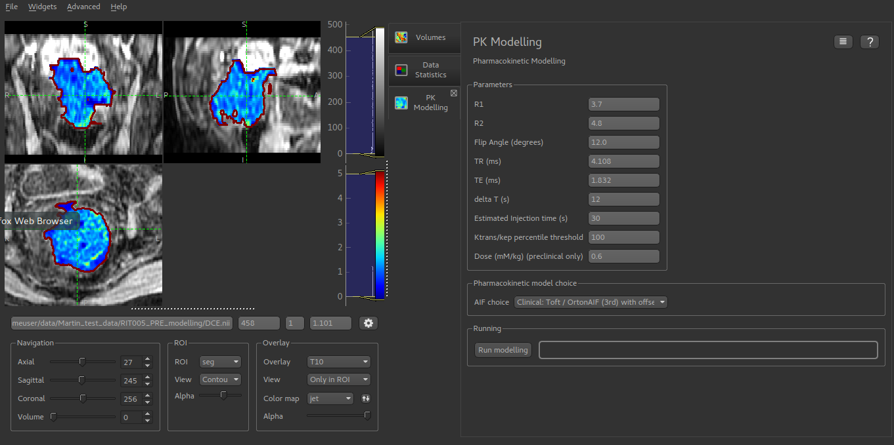
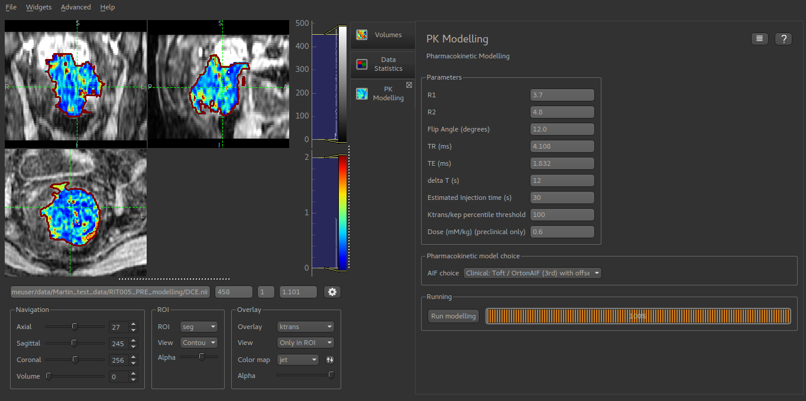

DCE PK modelling
================

*Widgets -> DCE-MRI -> PK Modelling*

The DCE modelling widget performs pharmacokinetic modelling for Dynamic Contrast-Enhanced MRI (DCE) using the Tofts model.

To use the tool you must first load a DCE-MRI volume, an ROI and a T10 overlay (named 'T10').

Next you must select the model, which determines the AIF (Arterial Input Function) in use. The Orton
AIF is provided for clinical data, and a Weinmann AIF for preclinical applications.

Image acquisition parameters are set using the GUI controls. Once these are correct, click 'Run' to start the 
modelling process. This could take some time, depending on your data, the progress bar is updated in
chunks.

*Start of modelling, showing loaded T10 map*

*Modelling complete with newly generated Ktrans map*

*Still required:*

- Inclusion of Contrast-to-noise ratio restriction
