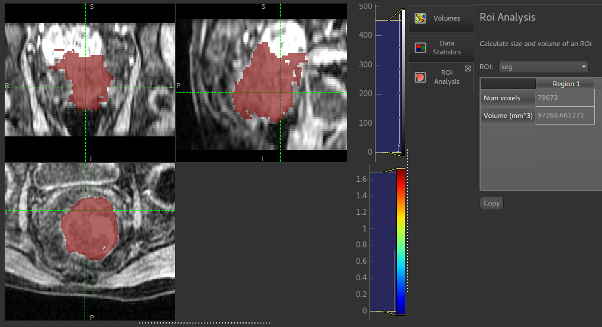

ROI Analysis
============

*Widgets -> ROIs -> ROI Analysis*

This widget performs a simple calculation of volume and number of voxels within each ROI region.

The output table can be copied and pasted into most spreadsheet applications (e.g. Excel)
