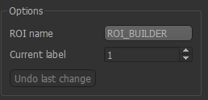
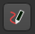
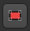
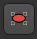
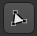
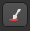

ROI Builder
===========

- *Widgets -> ROIs -> ROI Builder*

This widget is designed for simple construction of regions of interest and manual segmentation. It is not 
designed to be a replacement for sophisticated semi-automatic segmentation tools! However it is very helpful
when running intensive analysis processes as you can easily define a small ROI to run test analyses
within before you process the full data set.

Basic concept
-------------

At the top of the widget, you can choose the name of the ROI you are building. You can also select the 
ID of the region you are currently constructing - ROIs can have multiple region IDs, for example to 
identify two distinct tumours.

Below these options is the toolbox. 

.. image:: screenshots/roi_builder_tools.png

Each tool allows you to modify the ROI region - typically (but now always) on a single slice
of the image.
Another use of the ROI tool is for quick definition of simple ROIs for testing. For example you 
could define a small region of a few voxels to test a long-running analysis procedure before running it on the 
full image. In this case, defining a region on a single slice may be sufficient.

Tools
-----

|xhairs| Crosshairs
~~~~~~~~~~~~~~~~~~~

This tool is used to revert to the use of mouse clicks to select points/slices of focus rather than
select an ROI region. This is helpful in selecting the slice you are working on without accidentally defining a
new ROI region.

|pen| Pen
~~~~~~~~~

This is a typical tool for manual segmentation. Click and drag to draw a boundary around the region you want to
select. Clicking ``Add`` adds the interior of the region to the ROI. Generally with manual segmentation, you work 
slice by slice, drawing around the regions as you go. If you are doing this, you may want to maximise one of the 
viewing windows first. 

|walker| Walker
~~~~~~~~~~~~~~~

.. |walker| image:: screenshots/roi_tools_walker.png 

This provides simple automatic segmentation using the random walk algorithm. Mouse clicks select points
known to be inside (red flags) or outside (white flags) the region of interest - a menu allows you to 
change between these modes. When some points have been selected, the ``Segment`` button will generate an
ROI which includes the red flags and excludes the white flags.

This process can be carried out on a slice-by-slice basis, or across the whole 3D volume - the ``segmentation
Mode`` menu allows you to choose which.

|rectangle| Rectangle
~~~~~~~~~~~~~~~~~~~~~

Simple click-and-drag to select a rectangular region. When you are happy, click ``Add`` to add it to the ROI, or 
click ``Discard`` to ignore it.

|ellipse| Ellipse
~~~~~~~~~~~~~~~~~

Identical to the ``Rectangle`` tool, but selects an elliptical region

|poly| Polygon
~~~~~~~~~~~~~~

In this tool, each click on the image adds a vertex of a polygon region. When you click ``Add`` the last node is
connected to the first node to close the polygon, and the interior is selected. Clicks within a different
slice window are ignored.

|region| Choose Region
~~~~~~~~~~~~~~~~~~~~~~

This tool allows you to choose a region of an existing ROI - for example to isolate a particular cluster
or supervoxel. Using the menu, select the existing ROI and then click on a point to choose the region
it lies within. The region will be displayed in isolation and you can choose to 'Accept' or 'Cancel' the
selection.

|eraser| Eraser
~~~~~~~~~~~~~~~

With this tool, click on individual voxels to remove them from the ROI.

Undo
----

Most changes can be undone by clicking on the ``Undo`` button. Generally the last 10 additions 
or removals can be undone.
