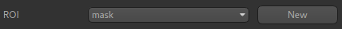
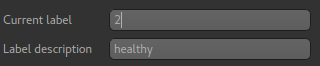
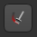
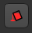
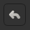

ROI Builder
===========

- *Widgets -> ROIs -> ROI Builder*

This widget is designed for simple construction of regions of interest and manual segmentation. It is not 
designed to be a replacement for sophisticated semi-automatic segmentation tools! However it is very helpful
when running intensive analysis processes as you can easily define a small ROI to run test analyses
within before you process the full data set.

Basic concept
-------------

At the top of the widget, you can choose the ROI to edit. This might be an existing ROI, but often
you will want to create a new ROI. To do this, click the ``New`` button and provide the name of
your new ROI, and in addition a data set which defines the data space on which it will be defined.

Labels
~~~~~~

All the ROI builder tools either add regions to the ROI or remove them. ROIs can have multiple
distinct regions identified by a label (an integer 1 or above - 0 is used to indicate 'outside the
ROI'), and an optional name (which appears in some other widgets, e.g. the Data Statistics widget).

The ``Current Label`` selector can be used to choose what label new ROI regions are added under.
You can also edit the name of a label using the ``Label Name`` edit box. New labels which do not
yet exist in the ROI get the default name ``Region <n>`` where ``<n>`` is the label identifier.

Tools
-----

.. image:: screenshots/roi_builder_tools.png
    :align: right

Each tool allows you to modify the ROI region - typically (but now always) on a single slice
of the image.

Many of the tools work by selecting a region and then have four options as to how to use this
region to modify the ROI:

 - ``Add`` means the selected voxels are given the value of the current label
 - ``Erase`` means the selected voxels are removed from the ROI (given a label of 0)
 - ``Mask`` means that voxels *outside* the selected voxels are removed from the ROI (given a label of 0)
 - ``Discard`` means that the selection is removed without affecting the ROI.

|xhairs| Crosshairs
~~~~~~~~~~~~~~~~~~~

.. |xhairs| image:: screenshots/roi_tools_xhairs.png 

This tool does not modify the ROI at all. Instead, is used to revert to the use of mouse clicks to 
select points/slices of focus rather than select an ROI region. This is helpful in selecting 
the slice you are working on without accidentally defining a new ROI region.

|pen| Pen
~~~~~~~~~

.. |pen| image:: screenshots/roi_tools_pen.png 

This is a typical tool for manual segmentation. Click and drag to draw a boundary around the region you want to
select. Clicking ``Add`` adds the interior of the region to the ROI. Generally with manual segmentation, you work 
slice by slice, drawing around the regions as you go. If you are doing this, you may want to maximise one of the 
viewing windows first. This tool should work with alternative pointing systems, such as touchscreens
and drawing tablets.

|paint| Paint
~~~~~~~~~~~~~~

With this tool individual voxels can be painted on by clicking and dragging the mouse. The brush
size can be modified from 1 (individual voxels) upwards, e.g. ``3`` will paint a rectangle of 3x3 
voxels. Note that painting is 2D only - you cannot paint a 3x3x3 3D block without painting each 
slice separately.

|eraser| Eraser
~~~~~~~~~~~~~~~

.. |eraser| image:: screenshots/roi_tools_eraser.png 

This tool is very similar to the ``Paint`` tool, only voxels are erased rather than painted. The brush size can be 
modified to erase larger regions - see the ``Paint`` tool for more information.

|rectangle| Rectangle
~~~~~~~~~~~~~~~~~~~~~

.. |rectangle| image:: screenshots/roi_tools_rectangle.png 

Simple click-and-drag to select a rectangular region. When you are happy, click ``Add`` to add it to the ROI, or 
click ``Discard`` to ignore it.

|ellipse| Ellipse
~~~~~~~~~~~~~~~~~

.. |ellipse| image:: screenshots/roi_tools_ellipse.png 

Identical to the ``Rectangle`` tool, but selects an elliptical region

|poly| Polygon
~~~~~~~~~~~~~~

.. |poly| image:: screenshots/roi_tools_polygon.png 

In this tool, each click on the image adds a vertex of a polygon region. When you click ``Add`` the last node is
connected to the first node to close the polygon, and the interior is selected. Clicks within a different
slice window are ignored.

|region| Choose Region
~~~~~~~~~~~~~~~~~~~~~~

.. |region| image:: screenshots/roi_tools_region.png 

This tool allows you to choose a region of an existing ROI - for example to isolate a particular cluster
or supervoxel. 

Using the menu, select the existing ROI and then click on a point to choose the region
it lies within. The region will be displayed in isolation and you can choose to 'Accept' or 'Cancel' the
selection.

|walker| Walker
~~~~~~~~~~~~~~~

.. |walker| image:: screenshots/roi_tools_walker.png 

This provides simple automatic segmentation using the random walk algorithm. Mouse clicks select points
known to be inside (red flags) or outside (white flags) the region of interest - a menu allows you to 
change between these modes. When some points have been selected, the ``Segment`` button will generate an
ROI which includes the red flags and excludes the white flags.

This process can be carried out on a slice-by-slice basis, or across the whole 3D volume - the ``segmentation
Mode`` menu allows you to choose which.

|bucket| Bucket fill
~~~~~~~~~~~~~~~~~~~~

This provides simple 3D 'bucket fill' tool. The image view is clicked to select the seed point, then
the tool selects all voxels which can be reached by moving from the seed point within the upper and 
lower threshold. There is also a max distance control to prevent the fill from progressing too far.

|undo| Undo
~~~~~~~~~~~

Most changes can be undone by clicking on the ``Undo`` button. Generally the last 10 additions 
or removals can be undone.
