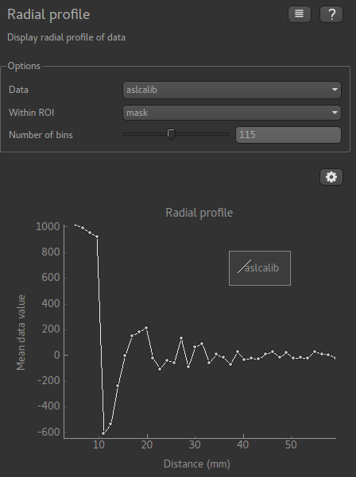

Radial profile widget
=====================

*Widgets -> Analysis -> Radial profile*

The radial profile widget plots the mean data value as a function of distance from the currently
selected point.

Any number of data sets can be selected, and the data can be restricted to within a region
of interest.

*Example*

