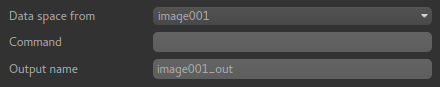

Simple maths
============

*Widgets -> Processing -> Simple Maths*

This widget is a simplified version of the console and allows new data to be created from
simple operations on existing data.

The data space for output must be specified by selecting a data set - this is necessary because
it's not generally possible to analyse the expression and determine the output space. Usualy 
the output data space will match the data space of the data sets used in the input.

The ``Command`` text entered must be a valid Python expression and can include the names 
of existing ROIs and overlays which will be Numpy arrays. Numpy functions can be accessed 
using the ``np`` namespace. Some knowledge of the Numpy library is generally needed to use 
this widget effectively.

An output name for the data set is also required.

Examples
--------

Add Gaussian noise to some data::

    mydata + np.random.normal(0, 100)

Calculate the difference between two data sets::

    mydata1 - mydata2

Scale data to range 0-1::

    (mydata - mydata.min()) / (mydata.max() - mydata.min())

