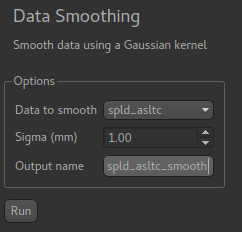
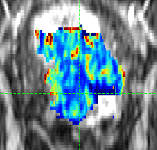
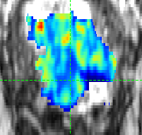

Smoothing
=========

*Widgets -> Processing -> Smoothing*

This widget provides simple Gaussian smoothing.

``Sigma`` is the standard deviation of the Gaussian used in the convolution in mm. Note that
if the voxel size of the data is different in different dimensions then the smoothing 
in *voxels* will be non-isotropic. For example if you select 1mm as ``sigma`` with data that
consists of 5mm slabs in the Z direction with 1mm resolution in the XY directions, then very 
little smoothing will be evident in the Z direction, but the XY slices will be visible
smoothed.

Sample input
------------

Sample output
------------

