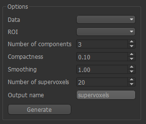
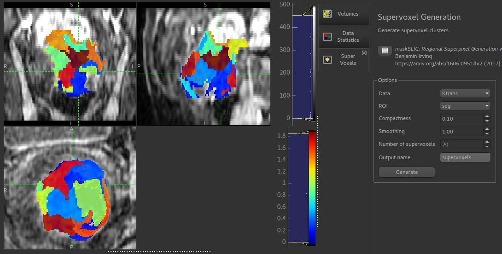

Supervoxel widget
=================

*Widgets -> Clustering -> Supervoxels*

This widget create supervoxels based a selected data map and a selected ROI.

Supervoxels are collections of voxels which are similar in terms of both data and also
spatial location. So, unlike clusters, supervoxels are intended to be connected and localised.

Quantiphyse uses a novel supervoxel method based on SLIC, but modified so that it can
be applied sensibly to data within an ROI. For full method details see 
https://arxiv.org/abs/1606.09518v2

Options
-------

The following options are available:

  - ``Data`` can be 3D or 4D data
  - ``ROI`` Select the ROI within which the supervoxels will be generated
  - ``Number of components`` PCA analysis is initially performed to reduce 4D data to a 3D volume, as with the clustering widget. This option controls the number of PCA components and is only visible for 4D data.
  - ``Compactness`` This takes values between 0 and 1 and balances the demands of spatial regularization with similarity of data. A high value will produce supervoxels dominated by spatial location, a low value will produce results similar to clustering with irregular and possibly disconnected supervoxel regions.
  - ``Smoothing`` Degree of smoothing to apply to the data prior to supervoxel generation
  - ``Number of supervoxels`` This is the number of seed points which are placed within the ROI, each of which will define a supervoxel.
  - ``Output name`` The data will be output as a new ROI with this name where each supervoxel is a separate numbered region.

Method
------

Seed points are placed within the ROI - one for each supervoxel - with initial positions determined by the need to be within the ROI and maximally separated from other seed points and the boundary.

For 4D data, PCA analysis is initially performed as described above. For 3D data, the only preprocessing is a scaling of the data to the range 0-1 to enable parameters such as compactness to have consistent meaning.

The output is an ROI in which each supervoxel is an ROI region. This enables use with for example, the mean values widget, which can replace the data in an overlay with a single value for each supervoxel.

Sample output
-------------

