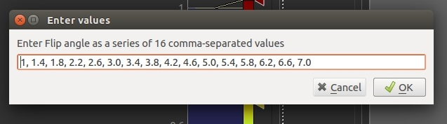
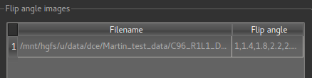
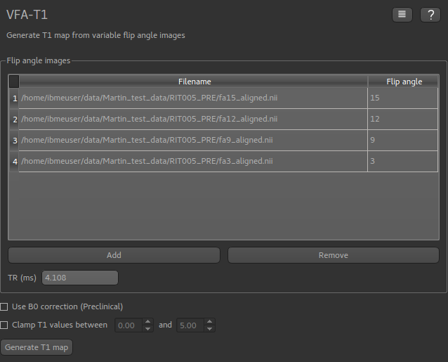

T1 map from VFA images
======================

*Widgets -> T1 -> VFA T1*

This widget generates T1 maps from variable flip angle images. This is often used as a preprocessing step for 
kinetic modelling. The VFA scans can be loaded either as separate volumes, one for each flip angle, or a single multi-volume 
file containing all the flip angles.

The main VFA method is described in [1]_.

Using a single 4D volume with multiple flip angles
--------------------------------------------------

Click ``Add`` to and select the data file containing the VFA images. You will then need to enter the flip angles 
as a comma separated list which must match the number of volumes in the data set.

Once loaded, the file will be added to the list:

Loading muliple flip angle volumes
----------------------------------

It is also common for the images at different flip angles to be stored in separate files. In this case, simply load 
each one separately, entering the flip angle for each (the widget will try to guess the flip angle if it is part of
the file name, but ensure it has guessed correctly!)

Using a B1 correction
---------------------

This option allows for correction of field inhomogeneity and B1 effects using Actual Flip Angle Imaging (AFI) data sets.
This is particularly common where high field strengths are used, for example in preclinical applications. The method is described 
in [2]_

These are loaded in the same way as the VFA data described above, however in this case you must enter the TR value for each
file in ms (or a sequence of TR values if the AFI data is stored in a single 4D data set).

The flip angle used for the AFI sequence is also required.

.. image:: screenshots/t1_afi.png

Applying Gaussian smoothing to the T1 map
-----------------------------------------

An optional postprocessing step is to apply smoothing to the output T1 map. The ``sigma`` value is standard deviation of
the Gaussian used as the smoothing kernel, and is measured in voxels. 

The ``Processing->Smoothing`` widget can also be used to apply smoothing to the output. This allows the kernel size to 
be specified in physical units (mm).

Clamping the T1 values
----------------------

The output T1 values may be clamped between limits if required - this may be useful to eliminate unrealistic values in a small number 
of voxels.

References 
----------

.. [1] Fram et al., Magn Reson Imaging 5(3): 201-208 (1987)
.. [2] Yarnykh, V. L. (2007), Actual flip‐angle imaging in the pulsed steady state: A method for rapid three‐dimensional mapping of the transmitted radiofrequency field. Magn. Reson. Med., 57: 192-200. doi:10.1002/mrm.21120
